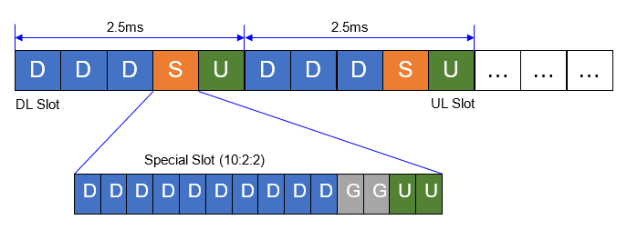

This document describes the basic functioning of the 5G MAC scheduler,
describes the periodic output, and explains
out the various configuration options that influence its behavior.

[[_TOC_]]

# General

The 5G MAC scheduler is a proportional fair (PF) scheduler, "approximating
wide-band CQI" (for lack of a better term, but CQI is typically used for PF)
through the selection of an MCS to use.

Concretely, the scheduler loops through all UEs and calculates the PF
coefficient using the currently selected MCS, and the historical achieved rate.
The UE with highest coefficient wins and is scheduled RBs until all resources
are used, or until it has no more data to fill RBs, in which the scheduler
continues with the UE with the second-best coefficient.

UEs with retransmissions are allocated first; similarly, UEs that have not been
scheduled for some time in UL are scheduled automatically in UL and have
therefore priority over data with "normal" traffic.

The MCS selection is done in `get_mcs_from_bler()` in file
[`gNB_scheduler_primitives.c`](../../openair2/LAYER2/NR_MAC_gNB/gNB_scheduler_primitives.c).
It consider two thresholds for a "BLER" that is computed from the number of
first-round retransmissions over total transmissions in the last window (50ms).
If that ratio is higher than an "upper" threshold (see
`dl/ul_bler_target_upper` in the configuration section below), it is
interpreted as "bad channel" and MCS is decremented by 1.  If the ratio is
lower than a "lower" threshold (see `dl/ul_bler_target_lower`), it is
interpreted as "good channel" and MCS is incremented by 1. This happens each
window.

The actual scheduler implementation can be found in functions `pf_dl()` and
`pf_ul()` in files
[`gNB_scheduler_dlsch.c`](../../openair2/LAYER2/NR_MAC_gNB/gNB_scheduler_dlsch.c)
(for DL) and
[`gNB_scheduler_ulsch.c`](../../openair2/LAYER2/NR_MAC_gNB/gNB_scheduler_ulsch.c)
(for UL), respectively.

## PDDCH aggregation level

PDCCH aggregation level is selected using closed loop controller, where DL HARQ
feedback is the controller feedback signal. It is used to increment `pdcch_cl_adjust`
variable if no feedback is detected and decrement the variable when feedback is detected.
`pdcch_cl_adjust` is later mapped to the PDCCH aggregation level range.

The value of `pdcch_cl_adjust` is clamped to range <0,1>, the increment value is 0.05 while
the decrement value is 0.01. These values are selected to ensure PDCCH success rate is high.
See Examples below for futher explaination.

The possible values of aggregation level on UE SS can be configured via `uess_agg_levels` configuration
option. By default the gNB uses only aggregation level 2 which translates to `uess_agg_levels` set to
`[0, 1, 0, 0, 0]`. For example, to enable aggregation level 2 and 4 set `uess_agg_levels` to `[0, 1, 1, 0, 0]`.

### Examples:
#### Example 1:
Say we have 90% PDCCH success rate at aggregation level 1, `pdcch_cl_adjust` will stay at 0
for most of the time. 2 consecutive PDCCH failures will not result in increasing the aggregation
level (because (0.05 + 0.05) * 4 = 0.4 which is closer to 0 than to 1). If PDCCH fails 3 times
in a row the aggregation level will change to 2 and hopefully back to 1 once more PDDCH successes
happen.

### Example 2
Say we have 0% PDCCH success rate (radio link failure scenario) but `pdcch_cl_adjust` is 0 indicating
perfect PDCCH channel. it would take ~18 PDCCH failures to reach maximum aggregation level.

# Periodic output and interpretation

The scheduler periodically outputs statistics that can help you judge the radio
channel quality, i.e., why a UE does not perform as you would expect. The
scheduler outputs this info in log level "INFO". The same information is also
available in the the file `nrMAC-stats.log` in the same directory in which
`nr-softmodem` is run.

Example:

```
UE RNTI 2460 CU-UE-ID 2 in-sync PH 28 dB PCMAX 24 dBm, average RSRP -74 (8 meas)
UE 2460: CQI 15, RI 2, PMI (14,1)
UE 2460: UL-RI 2 TPMI 0
UE 2460: dlsch_rounds 32917/5113/1504/560, dlsch_errors 211, pucch0_DTX 1385, BLER 0.19557 MCS (1) 23
UE 2460: ulsch_rounds 3756/353/182/179, ulsch_errors 170, ulsch_DTX 285, BLER 0.33021 MCS (1) 27 (Qm 8  dB) NPRB 5  SNR 31.0 dB
UE 2460: MAC:    TX     1530943191 RX         194148 bytes
UE 2460: LCID 1: TX            651 RX           3031 bytes
UE 2460: LCID 2: TX              0 RX              0 bytes
UE 2460: LCID 4: TX     1526169592 RX          16152 bytes
```

In the first line,
* `UE RNTI` (here `2460`): this is also used as the DU UE ID over F1; each line
  is prepended with the RNTI
* `CU UE ID` (`2`): separate identifier from the RNTI to handle multiple
  UEs across DUs (in which case RNTI conflicts are possible)
* whether a UE is `in-sync` (actively being scheduled) or `out-of-sync` (the UE
  is not being scheduled, because it did not respond when being scheduled in UL
  or since it has radio-link failure
* `PH` (`28`): Power Headroom, the amount of power the UE has left. If it is > 40 you
  can achieve full UL throughput. `PCMAX` (`24 dBm`) is what the UE reported as
  maximum UL transmit power it can output in the channel.
* `RSRP` (`-74`): measured power of the DL reference signals at the UE. >-80dBm
  you should have full DL throughput. <-95 dBm, you are very limited in terms
  of connectivity.

The second and third line reflect channel state information (CSI) as
reported by the UE, and only appear if CSI-RS/SRS are enabled and _received_
(for some bands, they cannot be enabled):
* `CQI` (`15`): the channel quality indicator is a number between 0 and 15. It
  indicates the achievable spectral efficiency of the UE. 15 means highest, 0
  is lowest. This corresponds to a 4-bit table in 38.214 with actual spectral
  efficiencies in bits/s/Hz
* `RI`: Rank indicator 1-4. If 1 it means limited to 1 layer transmission on DL. 2 two layers, etc.
* `PMI`: precoding matrix indicator. It's a measure of the spatial-direction of
  the gNBs transmit array as seen by the UE. It indicates the precoding that
  the gNB applies. It should be more or less stationary unless the UE is moving
  around quickly. It can jump when objects move around the UE
* `UL-RI`, `TPMI`: same as DL.

The fourth and fifth line show HARQ-related information:
* `dlsch_rounds A/B/C/D` (`32917/5113/1504/560`). This is the number of
  transmissions by the gNB for each round of the HARQ protocol. `A` is the first
  round, B is the second, etc. If `A` is high and `B` is low, `C` is lower and `D` is
  around 0, then things work well. If `B` is around the same as `A`, then the first
  round is almost always in error. This is not usually good unless the UE is
  far from the gNB.
* `dlsch_errors` (`211`) is the number of errors, meaning that after 4
  transmissions the MAC transport block was not received by the UE. A high
  number is not good/it should be a very low number, again unless there are
  severe radio conditions.
* `pucch0_DTX`: this is the number of PUCCH format 0 (or 1 later) missed
  detections (unreceived ack/nak). This means that either the UL is very bad
  and ACK/NAK cannot be conveyed properly or DL DCIs are missed by the UE. This
  is also something that should be very small compared to `A` in
  `dlsch_rounds`.
* `DLSCH BLER` is the current measured block-error rate of the DLSCH. Basically
  a moving average of `B`/`A` in `dlsch_rounds`. This is something that should always
  be close to the target bler that the MAC scheduler uses. typically 10-30% if
  we want a high throughput scheduling policy.
* `MCS (Q) M`: M (0-28) is the current MCS used by the MAC scheduler and Q is
  the mcs table: 0=64QAM, 1=256QAM, 2=low SE table for URLLC
* `ulsch_rounds`/`ulsch_errors`: same as DLSCH but for UL.
* `ulsch_DTX` (`285`): number of PUSCH missed detection (i.e. signal energy below
  threshold in configuration file, `L1s.pusch_dtx_threshold`, which is 10 times the
  actual unnormalized digital signal level). This is an indication of either
  very poor radio conditions (UE cannot reach the gNB), power control problems,
  or missed DCI 0\_x DCIs. It should be low compared to `A` in `ulsch_rounds`
  when things are working properly.
* ULSCH `BLER/MCS`: same as DLSCH but for UL.
* ULSCH `Qm X deltaMCS Y dB`: modulation order: 2=QPSK, 4=16QAM, 6=64QAM,
  8=256QAM and the dB offset for deltaMCS component in PUSCH power control law.
  If deltaMCS is disabled (this is the default) then it indicates 0. When
  deltaMCS is enabled it indicates the current power offset applied by the UE
  on the UL corresponding to the scheduled MCS
* ULSCH `NPRB`: current number of PRBs scheduled by the gNB. This will
  fluctuate a lot but when doing high throughput with iperf, it indicates the
  number of PRBs that the UE is actually able to use with its power budget and
  should be high.
* ULSCH `SNR`: the current SNR that the gNB receives the UE signal with. It
  should be close to the target in the gNB configuration file,
  `pusch_TargetSNRx10`, which should be around 10 times the value shown in the
  log

In the last lines:
* `MAC` shows the amount of MAC PDU bytes scheduled in transmit (`TX`,
  `1530943191`) and receive (`RX`, `194148`) directions
* `LCID X` shows the amount of MAC SDU/RLC PDU data for Logical Channel ID with
  ID `X` in transmit and receive directions. LCIDs 1 and 2 are mapped to SRBs 1
  and 2. LCIDs 4 and onward are mapped to DRBs 1 onward. If you have an LCID 4,
  it means you have a PDU session.

# Configuration of the MAC

## Split-related options (running in a DU)

See [nFAPI documentation](../nfapi.md) or [Aerial
tutorial](../Aerial_FAPI_Split_Tutorial.md) for information about the (n)FAPI
split.

See [F1 documentation](../F1-design.md) for information about the F1 split.

## MAC scheduler-related configuration options

The following options have an influence on the MAC scheduler operation (for all
UEs, if applicable), either on the MAC scheduler operation directly or how a UE
is configured.

In the `MACRLCs` section of the gNB/DU configuration file:

* `ulsch_max_frame_inactivity` (default 10): number of frames before a UE is
  scheduled automatically in UL. Lowering can improve latency at the expense of
  more resources in idle (which limits the number of UEs, and increases UE
  power consumption)
* `pusch_TargetSNRx10` (default 200): target SNR in PUSCH times 10 (200
  corresponds to 20dB target SNR)
* `pucch_TargetSNRx10` (default 150): target SNR in PUCCH times 10 (as above)
* `ul_prbblack_SNR_threshold` (default 10): target SNR for disabling RB
  scheduling in uplink on affected RBs.
* `pucch_FailureThres` (default 10): number of DTX on PUCCH after which
  scheduler declares UE in radio link failure and moves it to "out-of-sync
  state". **Currently not used**.
* `pusch_FailureThres` (default 10): number of DTX on PUSCH after which
  scheduler declares UE in radio link failure and moves it to "out-of-sync
  state"
* `dl_bler_target_upper` (default 0.15): upper threshold of BLER (first round
  retransmission over initial transmission) to decrease MCS by 1
* `dl_bler_target_lower` (default 0.05): lower threshold of BLER (first round
  retransmission over initial transmission) to increase MCS by 1
* `dl_max_mcs` (default 28): maximum MCS to use
* `ul_bler_target_upper` (default 0.15): as `dl_bler_target_upper`
* `ul_bler_target_lower` (default 0.05): as `dl_bler_target_lower`
* `ul_max_mcs` (default 28): as `dl_max_mcs`
* `dl_harq_round_max` (default 4): maximum number of HARQ rounds, i.e.,
  retransmissions to perform, in DL
* `ul_harq_round_max` (default 4): as `dl_harq_round_max`
* `min_grant_prb` (default 5): number of PRBs to schedule for UE after activity
  (see `ulsch_max_frame_inactivity`) or after scheduling request (SR)
* `min_grant_mcs` (default 9): MCS to use for UE after activity (see
  `ulsch_max_frame_inactivity`) or after scheduling request (SR)
* `identity_precoding_matrix` (default 0=false): flag to enable to use only
  the identity precoding matrix in DL precoding
* `set_analog_beamforming` (default 0=false): flag to enable analog
  beamforming (for more information [`analog_beamforming.md`](../analog_beamforming.md))
* `beam_duration` (default 1): duration/number of consecutive slots for a given set of
  beams, depending on hardware switching performance
* `beams_per_period` (default 1): set of beams that can be simultaneously allocated in a
  period (`beam_duration`)
* `pusch_RSSI_Threshold`: Value between -1280 and 0 which maps to range
   from -128.0 dBm/dBFS to 0.0 dBm/dBFS. This limits PUSCH TPC commands in
   case RSSI reaches the threshold and prevents ADC railing. Unit depends on
   RSSI reporting config.
* `pucch_RSSI_Threshold`: Same as above but for PUCCH

In the `gNBs` section of the gNB/DU configuration file: some of the parameters
affect RRC configuration (CellGroupConfig) of a UE, and are therefore listed
here, *also they pertain to the DU*, i.e., the scheduler.

* `pdsch_AntennaPorts_XP` (default 1): number of XP logical antenna
  ports in PDSCH (see also [`RUNMODEM.md`](../RUNMODEM.md))
* `pdsch_AntennaPorts_N1` (default 1): number of horizontal logical antenna
  ports in PDSCH (see also [`RUNMODEM.md`](../RUNMODEM.md))
* `pdsch_AntennaPorts_N2` (default 1): number of vertical logical antenna
  ports in PDSCH (see also [`RUNMODEM.md`](../RUNMODEM.md))
* `pusch_AntennaPorts` (default 1): number of antenna ports in PUSCH
* `maxMIMO_layers` (default -1=unlimited): maximum number of MIMO layers to use
  in downlink
* `sib1_tda` (default 1): time domain allocation (TDA) indices to use for SIB1
  (38.214 section 5.1.2.1.1)
* `do_CSIRS` (default 0): flag whether to use channel-state information
  reference signal (CSI-RS)
* `do_SRS` (default 0): flag whether to use sounding reference signal (SRS)
* `min_rxtxtime` (default 2): minimum feedback time for UE to respond to
  transmissions (k1 and k2 in 3GPP spec)
* `ul_prbblacklist`: PRBs that should not be used for UL scheduling. Cf with
  parameter `ul_prbblack_SNR_threshold` that does a similar thing based on
  measurements
* `force_256qam_off` (default 0=false): flag whether to disable 256QAM (limit to
  64QAM) in DL
* `force_UL256qam_off` (default 0=false): flag whether to disable 256QAM (limit to
  64QAM) in DL
* `disable_harq` (default 0=false): flag whether to disable HARQ completely
  (useful for NTN operation, see <../RUNMODEM.md>). **this is a Rel-17 feature
  and you need to have a capable UE for this**
* `use_deltaMCS` (default 0=false): flag whether to enable deltaMCS (**this is not fully tested
  and might not work** and you might need to adjust other parameters such as
  target SNRs)
* `num_dlharq` (default 16): number of HARQ processes to use in DL (other valid
  options are 2, 4, 6, 8, 10, 12, 32; **32 is a Rel-17 features**)
* `num_ulharq` (default 16): as `num_dlharq` for UL (other valid option is 32;
  **32 is i Rel-17 feature**)

## ServingCellConfigCommon parameters

The `gNBs` configuration section has a big structure `servingCellConfigCommon`
that has an influence on the overall behavior of MAC and L1. As the name says,
this structure is a flat representation of the ServingCellConfigCommon
structure, specified by 3GPP. Describing all of these parameters would be too
exhaustive; more information about the individual fields can be found in 3GPP
TS 38.331, section 6.3.2 "Radio resource control information elements".

Below is a description of some of these parameters.

### Frequency configuration

There are many parameters, such as `absoluteFrequencySSB`, etc., that have an
impact on the frequency used by the gNB. For more information, please check the
[corresponding document](../gNB_frequency_setup.md).

### TDD pattern configuration

The TDD configuration parameters allow to use one or two TDD patterns.

#### Single TDD pattern

Configure the TDD pattern through these options:
- `dl_UL_TransmissionPeriodicity`: Refers to the UL/DL slots periodicity for
  the TDD pattern. See below for valid numbers.
- `nrofDownlinkSlots`: Refers to the number of consecutive DL slots in the TDD
  pattern. The number of DL slots depends on the TDD period.
- `nrofDownlinkSymbols`: Indicates the number of consecutive DL symbols within
  the special slot that follows the downlink slots in the TDD pattern. The
  special slot is needed only to switch from DL to UL. The maximum number of
  symbols in this slot is 14.
- `nrofUplinkSlots`: Refers to the number of consecutive UL slots in the TDD
  pattern, depending on the desired TDD period.
- `nrofUplinkSymbols`: Indicates the number of consecutive UL symbols within
  the special slot that follows the downlink slots in the TDD pattern. The sum
  of downlink and uplink symbols should not exceed 14.
- `prach_ConfigurationIndex`: index for PRACH according to tables 6.3.3.2-2 to
  6.3.3.2-4 in TS 38.211.

As an example, the below figure shows a single TDD pattern, consisting of 3 DL
slots, 1 mixed slots (with 10 DL, 2 guard, 2 UL symbols), and 1 UL slot.



To configure this pattern in the configuration file, use

```plaintext
#dl_UL_TransmissionPeriodicity  0=ms0p5, 1=ms0p625, 2=ms1, 3=ms1p25, 4=ms2, 5=ms2p5, 6=ms5, 7=ms10, 8=ms3, 9=ms4

dl_UL_TransmissionPeriodicity = 5;
nrofDownlinkSlots             = 3;
nrofDownlinkSymbols           = 10;
nrofUplinkSlots               = 1;
nrofUplinkSymbols             = 2;
```

The `dl_UL_TransmissionPeriodicity` is set to `5` (2.5ms). The above figure
shows two TDD periods over 5ms. The 10 ms frame period must be strictly
divisible by the sum of the TDD pattern periods.

#### Two TDD patterns

An optional `pattern2` structure is used to signal a TDD pattern 2.
In this case, the TDD pattern may have two extended values of 3 ms and 4 ms.
These values are standardized as `dl-UL-TransmissionPeriodicity-v1530`. For the
sake of simplicity of the gNB configuration file, we have extended the set of
`dl-UL-TransmissionPeriodicity` values to support the new TDD periods, as
explained in the table below. However, these values will later be encoded as
`dl-UL-TransmissionPeriodicity-v1530` to match the specifications.

| `dl_UL_TransmissionPeriodicity` | TDD period |
|---------------------------------|------------|
| 0                               | 0.5 ms     |
| 1                               | 0.625 ms   |
| 2                               | 1 ms       |
| 3                               | 1.25 ms    |
| 4                               | 2 ms       |
| 5                               | 2.5 ms     |
| 6                               | 5 ms       |
| 7                               | 10 ms      |
| 8                               | 3 ms       |
| 9                               | 4 ms       |

The 10 ms frame period must be strictly divisible by the sum of the TDD pattern
periods. For example, the 3 ms TDD pattern should be used with a second TDD
pattern of 2 ms. Additionally, the 4 ms TDD pattern should be used with a
second TDD pattern of 1 ms.

As an example, this configuration might be used, where the first TDD pattern is
followed by a second, consisting of 4 DL slots.
```
# pattern1
# dl_UL_TransmissionPeriodicity
# 0=ms0p5, 1=ms0p625, 2=ms1, 3=ms1p25, 4=ms2, 5=ms2p5, 6=ms5, 7=ms10
# ext: 8=ms3, 9=ms4
dl_UL_TransmissionPeriodicity  = 8;
nrofDownlinkSlots              = 3;
nrofDownlinkSymbols            = 6;
nrofUplinkSlots                = 2;
nrofUplinkSymbols              = 4;

# pattern2
pattern2: {
    dl_UL_TransmissionPeriodicity2 = 4;
    nrofDownlinkSlots2             = 4;
    nrofDownlinkSymbols2           = 0;
    nrofUplinkSlots2               = 0;
    nrofUplinkSymbols2             = 0;
};
```
