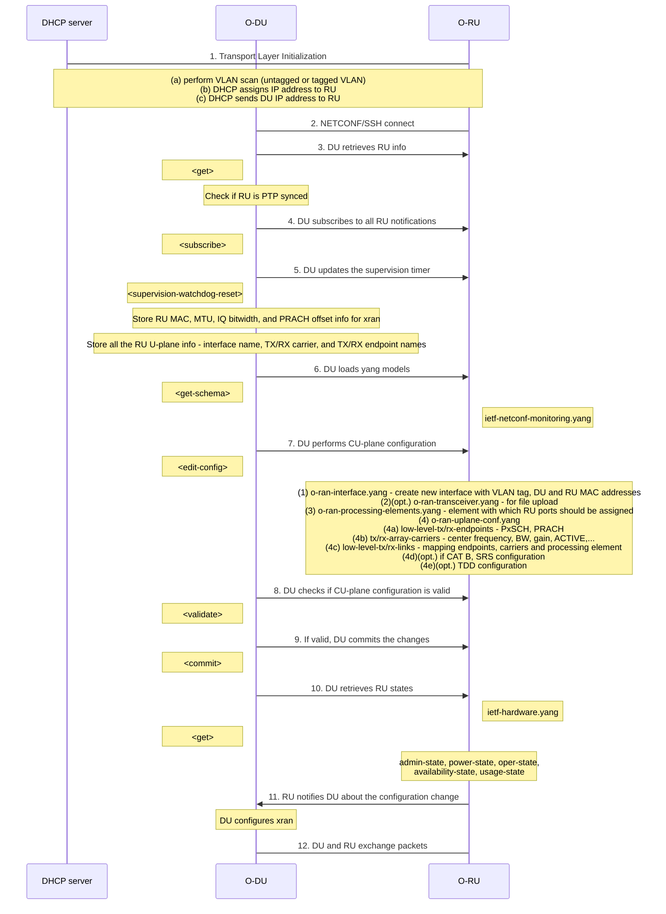

<table style="border-collapse: collapse; border: none;">
  <tr style="border-collapse: collapse; border: none;">
    <td style="border-collapse: collapse; border: none;">
      <a href="http://www.openairinterface.org/">
         
         </img>
      </a>
    </td>
    <td style="border-collapse: collapse; border: none; vertical-align: center;">
      <b><font size = "5">OAI 7.2 Fronthaul Interface 5G SA Tutorial</font></b>
    </td>
  </tr>
</table>

**Table of Contents**

[[_TOC_]]

# Prerequisites

The hardware on which we have tried this tutorial:

|Hardware (CPU,RAM)                       |Operating System (kernel)                       |NIC (Vendor,Driver,Firmware)             |
|-----------------------------------------|------------------------------------------------|-----------------------------------------|
|Intel(R) Xeon(R) Gold 6354 36-Core, 128GB|RHEL 9.2 (5.14.0-284.18.1.rt14.303.el9_2.x86_64)|Intel X710, i40e, 9.20 0x8000d95e 22.0.9 |
|Intel(R) Xeon(R) Gold 6354 36-Core, 128GB|Ubuntu 22.04.3 LTS (5.15.0-1033-realtime)       |Intel X710, i40e, 9.00 0x8000cfeb 21.5.9 |
|AMD EPYC 9374F 32-Core Processor, 128GB  |Ubuntu 22.04.2 LTS (5.15.0-1038-realtime)       |Intel E810 ,ice, 4.00 0x8001184e 1.3236.0|

**NOTE**: 

- These are not minimum hardware requirements. This is the configuration of our servers. 
- The NIC card should support hardware PTP time stamping. 
- If you are using Intel servers then use only Ice Lake or newer generations. In case of AMD use only 4th generation, Genoa or newer. 
- If you try on any other server apart from the above listed, then choose a desktop/server with clock speed higher than 3.0 GHz and `avx512` capabilities. 
- This tutorial gives few instructions for Arm targets, but DU execution on Arm systems is yet not functional.  
This feature is intended to enable experiments and future improvements on Arm systems.

NICs we have tested so far:

|Vendor         |Firmware Version        |
|---------------|------------------------|
|Intel X710     |9.20 0x8000d95e 22.0.9  |
|Intel E810-XXV |4.00 0x8001184e 1.3236.0|
|E810-C         |4.20 0x8001784e 22.0.9  |
|Intel XXV710   |6.02 0x80003888         |

**Note**:

- With AMD servers/desktop machines with PCIe 5.0 we have only used E810 cards.
- If you are using Mellanox NIC, please be aware that DPDK can't bind the NIC as vfio-pci. Instead it must be bind with mlx driver.

PTP enabled switches and grandmaster clock we have in are lab:

|Vendor                  |Software Version|
|------------------------|----------------|
|CISCO C93180YC-FX3      |10.2(4)         |
|Fibrolan Falcon-RX/812/G|8.0.25.4        |
|Qulsar Qg2 (Grandmaster)|12.1.27         |

**S-Plane synchronization is mandatory.** S-plane support is done via `ptp4l` and `phc2sys`. Make sure your version matches. 

| Software  | Software Version |
|-----------|------------------|
| `ptp4l`   | 3.1.1            |
| `phc2sys` | 3.1.1            |

We have only verified LLS-C3 configuration in our lab, i.e.  using an external
grandmaster, a switch as a boundary clock, and the gNB/DU and RU.  We haven't
tested any RU without S-plane. Radio units we are testing/integrating:

|Vendor           |Software Version      |
|-----------------|----------------------|
|VVDN LPRU        |03-v3.0.5             |
|LiteON RU        |01.00.08/02.00.03     |
|Benetel 650      |RAN650-1v1.0.4-dda1bf5|
|Benetel 550 CAT-A|RAN550-1v1.0.4-605a25a|
|Foxconn RPQN     |v3.1.15q.551_rc10     |

Tested libxran releases:

| Vendor                                  |
|-----------------------------------------|
| `oran_e_maintenance_release_v1.0`       |
| `oran_f_release_v1.0`                   |


**Note**: The libxran driver of OAI identifies the above E release version as "5.1.0" (E is fifth letter, then 1.0), and the above F release as "6.1.0".

## Configure your server

1. Disable Hyperthreading (HT) in your BIOS. In all our servers HT is always disabled.
2. We recommend you to start with a fresh installation of OS (either RHEL or Ubuntu). You have to install realtime kernel on your OS (Operating System). Based on your OS you can search how to install realtime kernel.
3. Install realtime kernel for your OS
4. Change the boot commands based on the below section. They can be performed either via `tuned` or via manually building the kernel

### CPU allocation

**This section is important to read, regardless of the operating system you are using.**

Your server could be:

* One NUMA node (See [one NUMA node example](#111-one-numa-node)): all the processors are sharing a single memory system.
* Two NUMA nodes (see [two NUMA nodes example](#112-two-numa-node)): processors are grouped in 2 memory systems.
  - Usually the even (ie `0,2,4,...`) CPUs are on the 1st socket
  - And the odd (ie (`1,3,5,...`) CPUs are on the 2nd socket

DPDK, OAI and kernel threads require to be properly allocated to extract maximum real-time performance for your use case.

1. **NOTE**: Currently the default OAI 7.2 configuration file requires isolated **CPUs 0,2,4** for DPDK/libXRAN, **CPU 6** for `ru_thread`, **CPU 8** for `L1_rx_thread` and **CPU 10** for `L1_tx_thread`. It is preferrable to have all these threads on the same socket.
2. Allocating CPUs to the OAI nr-softmodem is done using the `--thread-pool` option. Allocating 4 CPUs is the minimal configuration but we recommend to allocate at least **8** CPUs. And they can be on a different socket as the DPDK threads.
3. And to avoid kernel preempting these allocated CPUs, it is better to force the kernel to use un-allocated CPUs.

Let summarize for example on a `32-CPU` single NUMA node system, regardless of the number of sockets:

|Applicative Threads|Allocated CPUs    |
|-------------------|------------------|
|XRAN DPDK usage    |0,2,4             |
|OAI `ru_thread`    |6                 |
|OAI `L1_rx_thread` |8                 |
|OAI `L1_tx_thread` |10                |
|OAI `nr-softmodem` |1,3,5,7,9,11,13,15|
|kernel             |16-31             |

In below example we have shown the output of `/proc/cmdline` for two different servers, each of them have different number of NUMA nodes. **Be careful in isolating the CPUs in your environment.** Apart from CPU allocation there are additional parameters which are important to be present in your boot command.

Modifying the `linux` command line usually requires to edit string `GRUB_CMDLINE_LINUX` in `/etc/default/grub`, run a `grub` command and reboot the server.

* Set parameters `isolcpus`, `nohz_full` and `rcu_nocbs` with the list of CPUs to isolate for XRAN.
* Set parameter `kthread_cpus` with the list of CPUs to isolate for kernel.

Set the `tuned` profile to `realtime`. If the `tuned-adm` command is not installed then you have to install it. When choosing this profile you have to mention the isolated cpus in `/etc/tuned/realtime-variables.conf`. By default this profile adds `skew_tick=1 isolcpus=managed_irq,domain,<cpu-you-choose> intel_pstate=disable nosoftlockup` in the boot command. **Make sure you don't add them while changing `/etc/default/grub`**.

```bash
tuned-adm profile realtime
```

**Checkout anyway the examples below.**

### One NUMA Node

Below is the output of `/proc/cmdline` of a single NUMA node server,

```bash
NUMA:
  NUMA node(s):          1
  NUMA node0 CPU(s):     0-31
```

```bash
isolcpus=0-15 nohz_full=0-15 rcu_nocbs=0-15 kthread_cpus=16-31 rcu_nocb_poll nosoftlockup default_hugepagesz=1GB hugepagesz=1G hugepages=20 amd_iommu=on iommu=pt mitigations=off skew_tick=1 selinux=0 enforcing=0 tsc=reliable nmi_watchdog=0 softlockup_panic=0 audit=0 vt.handoff=7
```

Example taken for AMD EPYC 9374F 32-Core Processor

### Two NUMA Nodes

Below is the output of `/proc/cmdline` of a two NUMA node server,

```
NUMA:
  NUMA node(s):          2
  NUMA node0 CPU(s):     0,2,4,6,8,10,12,14,16,18,20,22,24,26,28,30,32,34
  NUMA node1 CPU(s):     1,3,5,7,9,11,13,15,17,19,21,23,25,27,29,31,33,35
```

```bash
mitigations=off usbcore.autosuspend=-1 intel_iommu=on intel_iommu=pt selinux=0 enforcing=0 nmi_watchdog=0 softlockup_panic=0 audit=0 skew_tick=1 isolcpus=managed_irq,domain,0,2,4,6,8,10,12,14,16 nohz_full=0,2,4,6,8,10,12,14,16 rcu_nocbs=0,2,4,6,8,10,12,14,16 rcu_nocb_poll intel_pstate=disable nosoftlockup cgroup_disable=memory mce=off hugepagesz=1G hugepages=40 hugepagesz=2M hugepages=0 default_hugepagesz=1G isolcpus=managed_irq,domain,0,2,4,6,8,10,12,14 kthread_cpus=18-35 intel_pstate=disable nosoftlockup tsc=reliable
```

Example taken for Intel(R) Xeon(R) Gold 6354 CPU @ 3.00GHz

### Common

Configure your servers to maximum performance mode either via OS or in BIOS. If you want to disable CPU sleep state via OS then use the below command:

```bash
# to disable
sudo cpupower idle-set -D 0
#to enable
sudo cpupower idle-set -E
```

The above information we have gathered either from O-RAN documents or via our own experiments. In case you would like to read the O-RAN documents then here are the links:

1. [O-RAN-SC O-DU Setup Configuration](https://docs.o-ran-sc.org/projects/o-ran-sc-o-du-phy/en/latest/Setup-Configuration_fh.html)
2. [O-RAN Cloud Platform Reference Designs 2.0,O-RAN.WG6.CLOUD-REF-v02.00,February 2021](https://orandownloadsweb.azurewebsites.net/specifications)


## PTP configuration

**Note**: You may run OAI with O-RAN 7.2 Fronthaul without a RU attached (e.g. for benchmarking).
In such case, you can skip PTP configuration and go to DPDK section.

1. You can install `linuxptp` rpm or debian package. It will install ptp4l and phc2sys.

```bash
#RHEL
sudo dnf install linuxptp -y
#Ubuntu
sudo apt install linuxptp -y
```

Once installed you can use this configuration file for ptp4l (`/etc/ptp4l.conf`). Here the clock domain is 24 so you can adjust it according to your PTP GM clock domain

```
[global]
domainNumber            24
slaveOnly               1
time_stamping           hardware
tx_timestamp_timeout    1
logging_level           6
summary_interval        0
#priority1               127

[your_PTP_ENABLED_NIC]
network_transport       L2
hybrid_e2e              0
```

You need to increase `tx_timestamp_timeout` to 50 or 100 for Intel E-810. You will see that in the logs of ptp.

Create the configuration file for ptp4l (`/etc/sysconfig/ptp4l`)

```
OPTIONS="-f /etc/ptp4l.conf"
```

Create the configuration file for phc2sys (`/etc/sysconfig/phc2sys`)

```
OPTIONS="-a -r -r -n 24"
```

The service of ptp4l (`/usr/lib/systemd/system/ptp4l.service`) should be configured as below:

```
[Unit]
Description=Precision Time Protocol (PTP) service
After=network-online.target
Wants=network-online.target

[Service]
Type=simple
EnvironmentFile=-/etc/sysconfig/ptp4l
ExecStart=/usr/sbin/ptp4l $OPTIONS

[Install]
WantedBy=multi-user.target
```

and service of phc2sys (`/usr/lib/systemd/system/phc2sys.service`) should be configured as below:

```
[Unit]
Description=Synchronize system clock or PTP hardware clock (PHC)
After=ntpdate.service ptp4l.service

[Service]
Type=simple
EnvironmentFile=-/etc/sysconfig/phc2sys
ExecStart=/usr/sbin/phc2sys $OPTIONS

[Install]
WantedBy=multi-user.target
```

### Debugging PTP issues

You can see these steps in case your ptp logs have erorrs or `rms` reported in `ptp4l` logs is more than 100ms.
Beware that PTP issues may show up only when running OAI and XRAN. If you are using the `ptp4l` service, have a look back in time in the journal: `journalctl -u ptp4l.service -S <hours>:<minutes>:<seconds>`

1. Make sure that you have `skew_tick=1` in `/proc/cmdline`
2. For Intel E-810 cards set `tx_timestamp_timeout` to 50 or 100 if there are errors in ptp4l logs
3. Other time sources than PTP, such as NTP or chrony timesources, should be disabled. Make sure they are enabled as further below.
4. Make sure you set `kthread_cpus=<cpu_list>` in `/proc/cmdline`.
5. If `rms` or `delay` in `ptp4l` or `offset` in `phc2sys` logs remain high then you can try pinning the `ptp4l` and `phc2sys` processes to an isolated CPU.

```bash
#to check there is NTP enabled or not
timedatectl | grep NTP
#to disable
timedatectl set-ntp false
```

## DPDK (Data Plane Development Kit)

Download DPDK version 20.11.9.

```bash
# on debian
sudo apt install wget xz-utils libnuma-dev
# on Fedora/RHEL
sudo dnf install wget xz numactl-devel
cd
wget http://fast.dpdk.org/rel/dpdk-20.11.9.tar.xz
```

### DPDK Compilation and Installation

```bash
# Installing meson : it should pull ninja-build and compiler packages
# on debian
sudo apt install meson
# on Fedora/RHEL
sudo dnf install meson
tar xvf dpdk-20.11.9.tar.xz && cd dpdk-stable-20.11.9

meson build
ninja -C build
sudo ninja install -C build
```

### Verify the installation is complete

Check if the LD cache contains the DPDK Shared Objects after update:

```bash
sudo ldconfig -v | grep rte_
	librte_fib.so.0.200.2 -> librte_fib.so.0.200.2
	librte_telemetry.so.0.200.2 -> librte_telemetry.so.0.200.2
	librte_compressdev.so.0.200.2 -> librte_compressdev.so.0.200.2
	librte_gro.so.20.0 -> librte_gro.so.20.0.2
	librte_mempool_dpaa.so.20.0 -> librte_mempool_dpaa.so.20.0.2
	librte_distributor.so.20.0 -> librte_distributor.so.20.0.2
	librte_rawdev_dpaa2_cmdif.so.20.0 -> librte_rawdev_dpaa2_cmdif.so.20.0.2
	librte_mempool.so.20.0 -> librte_mempool.so.20.0.2
	librte_pmd_octeontx2_crypto.so.20.0 -> librte_pmd_octeontx2_crypto.so.20.0.2
	librte_common_cpt.so.20.0 -> librte_common_cpt.so.20.0.2
....
```

You may not have the `/usr/local/lib`, `/usr/local/lib64`, or custom DPDK
installation paths in the `LD_LIBRARY_PATH`. In this case, add it as below; if
you installed into a
custom

```bash
sudo echo "/usr/local/lib" > /etc/ld.so.conf.d/local-lib.conf
sudo echo "/usr/local/lib64" >> /etc/ld.so.conf.d/local-lib.conf
sudo ldconfig
sudo ldconfig -v | grep rte_
```

Check if the PKG-CONFIG tool discovers the libraries:

```bash
pkg-config --libs libdpdk --static
```

<details>
<summary>Possible output</summary>

```console
-lrte_node -lrte_graph -lrte_bpf -lrte_flow_classify -lrte_pipeline -lrte_table -lrte_port -lrte_fib -lrte_ipsec -lrte_vhost -lrte_stack -lrte_security -lrte_sched -lrte_reorder -lrte_rib -lrte_rawdev -lrte_pdump -lrte_power -lrte_member -lrte_lpm -lrte_latencystats -lrte_kni -lrte_jobstats -lrte_ip_frag -lrte_gso -lrte_gro -lrte_eventdev -lrte_efd -lrte_distributor -lrte_cryptodev -lrte_compressdev -lrte_cfgfile -lrte_bitratestats -lrte_bbdev -lrte_acl -lrte_timer -lrte_hash -lrte_metrics -lrte_cmdline -lrte_pci -lrte_ethdev -lrte_meter -lrte_net -lrte_mbuf -lrte_mempool -lrte_rcu -lrte_ring -lrte_eal -lrte_telemetry -lrte_kvargs -Wl,--whole-archive -lrte_common_cpt -lrte_common_dpaax -lrte_common_iavf -lrte_common_octeontx -lrte_common_octeontx2 -lrte_bus_dpaa -lrte_bus_fslmc -lrte_bus_ifpga -lrte_bus_pci -lrte_bus_vdev -lrte_bus_vmbus -lrte_mempool_bucket -lrte_mempool_dpaa -lrte_mempool_dpaa2 -lrte_mempool_octeontx -lrte_mempool_octeontx2 -lrte_mempool_ring -lrte_mempool_stack -lrte_pmd_af_packet -lrte_pmd_ark -lrte_pmd_atlantic -lrte_pmd_avp -lrte_pmd_axgbe -lrte_pmd_bond -lrte_pmd_bnxt -lrte_pmd_cxgbe -lrte_pmd_dpaa -lrte_pmd_dpaa2 -lrte_pmd_e1000 -lrte_pmd_ena -lrte_pmd_enetc -lrte_pmd_enic -lrte_pmd_failsafe -lrte_pmd_fm10k -lrte_pmd_i40e -lrte_pmd_hinic -lrte_pmd_hns3 -lrte_pmd_iavf -lrte_pmd_ice -lrte_pmd_igc -lrte_pmd_ixgbe -lrte_pmd_kni -lrte_pmd_liquidio -lrte_pmd_memif -lrte_pmd_netvsc -lrte_pmd_nfp -lrte_pmd_null -lrte_pmd_octeontx -lrte_pmd_octeontx2 -lrte_pmd_pfe -lrte_pmd_qede -lrte_pmd_ring -lrte_pmd_sfc -lrte_pmd_softnic -lrte_pmd_tap -lrte_pmd_thunderx -lrte_pmd_vdev_netvsc -lrte_pmd_vhost -lrte_pmd_virtio -lrte_pmd_vmxnet3 -lrte_rawdev_dpaa2_cmdif -lrte_rawdev_dpaa2_qdma -lrte_rawdev_ioat -lrte_rawdev_ntb -lrte_rawdev_octeontx2_dma -lrte_rawdev_octeontx2_ep -lrte_rawdev_skeleton -lrte_pmd_caam_jr -lrte_pmd_dpaa_sec -lrte_pmd_dpaa2_sec -lrte_pmd_nitrox -lrte_pmd_null_crypto -lrte_pmd_octeontx_crypto -lrte_pmd_octeontx2_crypto -lrte_pmd_crypto_scheduler -lrte_pmd_virtio_crypto -lrte_pmd_octeontx_compress -lrte_pmd_qat -lrte_pmd_ifc -lrte_pmd_dpaa_event -lrte_pmd_dpaa2_event -lrte_pmd_octeontx2_event -lrte_pmd_opdl_event -lrte_pmd_skeleton_event -lrte_pmd_sw_event -lrte_pmd_dsw_event -lrte_pmd_octeontx_event -lrte_pmd_bbdev_null -lrte_pmd_bbdev_turbo_sw -lrte_pmd_bbdev_fpga_lte_fec -lrte_pmd_bbdev_fpga_5gnr_fec -Wl,--no-whole-archive -lrte_node -lrte_graph -lrte_bpf -lrte_flow_classify -lrte_pipeline -lrte_table -lrte_port -lrte_fib -lrte_ipsec -lrte_vhost -lrte_stack -lrte_security -lrte_sched -lrte_reorder -lrte_rib -lrte_rawdev -lrte_pdump -lrte_power -lrte_member -lrte_lpm -lrte_latencystats -lrte_kni -lrte_jobstats -lrte_ip_frag -lrte_gso -lrte_gro -lrte_eventdev -lrte_efd -lrte_distributor -lrte_cryptodev -lrte_compressdev -lrte_cfgfile -lrte_bitratestats -lrte_bbdev -lrte_acl -lrte_timer -lrte_hash -lrte_metrics -lrte_cmdline -lrte_pci -lrte_ethdev -lrte_meter -lrte_net -lrte_mbuf -lrte_mempool -lrte_rcu -lrte_ring -lrte_eal -lrte_telemetry -lrte_kvargs -Wl,-Bdynamic -pthread -lm -ldl
```
</details>

If DPDK was installed into `/usr/local/lib`, `/usr/local/lib64`, or another
custom path, you have to point to the right directory with `PKG_CONFIG_PATH`,
for instance:

```bash
export PKG_CONFIG_PATH=$PKG_CONFIG_PATH:/usr/local/lib64/pkgconfig/
pkg-config --libs libdpdk --static
```

### If you want to de-install this version of DPDK

Go back to the version folder you used to build and install

```
cd ~/dpdk-stable-20.11.9
sudo ninja deinstall -C build
```

# Build OAI-FHI gNB

Clone OAI code base in a suitable repository, here we are cloning in `~/openairinterface5g` directory,

```bash
git clone https://gitlab.eurecom.fr/oai/openairinterface5g.git ~/openairinterface5g
cd ~/openairinterface5g/
```

## Build ORAN Fronthaul Interface Library

Download ORAN FHI DU library, checkout the correct version, and apply the correct patch (available in `oai_folder/cmake_targets/tools/oran_fhi_integration_patches`).

### E release
```bash
git clone https://gerrit.o-ran-sc.org/r/o-du/phy.git ~/phy
cd ~/phy
git checkout oran_e_maintenance_release_v1.0
git apply ~/openairinterface5g/cmake_targets/tools/oran_fhi_integration_patches/E/oaioran_E.patch
```

### F release
```bash
git clone https://gerrit.o-ran-sc.org/r/o-du/phy.git ~/phy
cd ~/phy
git checkout oran_f_release_v1.0
git apply ~/openairinterface5g/cmake_targets/tools/oran_fhi_integration_patches/F/oaioran_F.patch
```

Compile the fronthaul interface library by calling `make` and the option
`XRAN_LIB_SO=1` to have it build a shared object. Note that we provide two
environment variables `RTE_SDK` for the path to the source tree of DPDK, and
`XRAN_DIR` to set the path to the fronthaul library.  
For building for a Arm target, set as well the environment variable `TARGET=armv8`.
DU execution on Arm systems is yet not functional.
This feature is intended to enable experiments and future improvements on Arm systems.

**Note**: you need at least gcc-11 and g++-11.

```bash
cd ~/phy/fhi_lib/lib
make clean
RTE_SDK=~/dpdk-stable-20.11.9/ XRAN_DIR=~/phy/fhi_lib make XRAN_LIB_SO=1 # E release
WIRELESS_SDK_TOOLCHAIN=gcc RTE_SDK=~/dpdk-stable-20.11.9/ XRAN_DIR=~/phy/fhi_lib make XRAN_LIB_SO=1 # F release
...
[AR] build/libxran.so
./build/libxran.so
```

The shared library object `~/phy/fhi_lib/lib/build/libxran.so` must be present
before proceeding.

## For Arm targets only: Install the Arm RAN Acceleration library

DU execution on Arm systems is yet not functional.
This feature is intended to enable experiments and future improvements on Arm systems.

Clone, configure and build ArmRAL:

Note: Use option `-DCMAKE_INSTALL_PREFIX=<install-dir>` of cmake to set the installation directory of ArmRAL to `<install-dir>`.
If you omit this option, ArmRAL is installed into `/usr/local`.

```
git clone https://git.gitlab.arm.com/networking/ral.git ~/ral
cd ~/ral
git checkout armral-25.01
mkdir build
cd build
cmake -GNinja -DBUILD_SHARED_LIBS=On ../
ninja
```

Once ArmRAL is configured at your convenience and built, you can install it:
```
ninja install
```

## Build OAI gNB

You can now proceed building OAI. You build it the same way as for other
radios, providing option `-t oran_fhlib_5g`. Additionally, you need to provide
it the location of the FH library: `--cmake-opt -Dxran_LOCATION=PATH`. Note
that since we cannot use `~` here, we resort to `$HOME`, which is equivalent.
Finally, if you needed to define `PKG_CONFIG_PATH` previously, you need to do
so now, too.

```bash
# You should have already cloned above
cd ~/openairinterface5g/cmake_targets
# if you installed DPDK in a custom path as described above
export PKG_CONFIG_PATH=$PKG_CONFIG_PATH:/usr/local/lib64/pkgconfig/
./build_oai -I  # if you never installed OAI, use this command once before the next line
./build_oai --gNB --ninja -t oran_fhlib_5g --cmake-opt -Dxran_LOCATION=$HOME/phy/fhi_lib/lib
```

You can optionally check that everything has been linked properly with
```bash
ldd ran_build/build/liboran_fhlib_5g.so
```

<details>
<summary>Possible output</summary>

```console
#check if all the libraries are properly linked to liboai_transpro.so
ldd ran_build/build/liboran_fhlib_5g.so
    linux-vdso.so.1 (0x00007fffb459e000)
    librte_node.so.21 => /usr/local/lib64/librte_node.so.21 (0x00007fd358690000)
    librte_graph.so.21 => /usr/local/lib64/librte_graph.so.21 (0x00007fd358685000)
    librte_bpf.so.21 => /usr/local/lib64/librte_bpf.so.21 (0x00007fd358672000)
    librte_flow_classify.so.21 => /usr/local/lib64/librte_flow_classify.so.21 (0x00007fd35866c000)
    librte_pipeline.so.21 => /usr/local/lib64/librte_pipeline.so.21 (0x00007fd35862f000)
    librte_table.so.21 => /usr/local/lib64/librte_table.so.21 (0x00007fd358612000)
    librte_port.so.21 => /usr/local/lib64/librte_port.so.21 (0x00007fd3585f8000)
    librte_fib.so.21 => /usr/local/lib64/librte_fib.so.21 (0x00007fd3585e9000)
...
    libm.so.6 => /lib64/libm.so.6 (0x00007fd357eb1000)
    libnuma.so.1 => /lib64/libnuma.so.1 (0x00007fd357ea1000)
    libc.so.6 => /lib64/libc.so.6 (0x00007fd357c98000)
    /lib64/ld-linux-x86-64.so.2 (0x00007fd3587c7000)
    libelf.so.1 => /lib64/libelf.so.1 (0x00007fd357c7d000)
    libz.so.1 => /lib64/libz.so.1 (0x00007fd357c61000)
```
</details>

Note that you might also call cmake directly instead of using `build_oai`:
```
cd ~/openairinterface5g
mkdir build && cd build
cmake .. -GNinja -DOAI_FHI72=ON -Dxran_LOCATION=$HOME/phy/fhi_lib/lib
ninja nr-softmodem oran_fhlib_5g params_libconfig
```

Note that in tags 2025.w06 and prior, the FHI72 driver used polling to wait for
the next slot. This is inefficient as it burns CPU time, and has been replaced
with a more efficient mechanism. Nevertheless, if you experience problems that
did not occur previously, it is possible to re-enable polling, either with
`build_oai` like this

    ./build_oai --gNB --ninja -t oran_fhlib_5g --cmake-opt -Dxran_LOCATION=$HOME/phy/fhi_lib/lib --cmake-opt -DOAI_FHI72_USE_POLLING=ON

or with `cmake` like so

    cmake .. -GNinja -DOAI_FHI72=ON -Dxran_LOCATION=$HOME/phy/fhi_lib/lib -DOAI_FHI72_USE_POLLING=ON
    ninja oran_fhlib_5g

# Configuration

RU and DU configurations have a circular dependency: you have to configure DU MAC address in the RU configuration and the RU MAC address, VLAN and Timing advance parameters in the DU configuration.

**Note**: You may run OAI with O-RAN 7.2 Fronthaul without a RU attached (e.g. for benchmarking).
In such case, skip RU configuration and only configure Network Interfaces, DPDK VFs and OAI configuration by using arbitrary values for RU MAC addresses and VLAN tags.

## Configure the RU

Contact the RU vendor and get the configuration manual to understand the below commands. The below configuration only corresponds to the RU firmware version indicated at the start of this document. If your firmware version does not correspond to the indicated version, then please don't try these commands.

**NOTE**: Please understand all the changes you are doing at the RU, especially if you are manipulating anything related to output power. 

### Benetel 650

**Valid only for version RAN650-1v1.0.4-dda1bf5**

The OAI configuration file [`gnb-du.sa.band77.273prb.fhi72.4x4-benetel650.conf`](../targets/PROJECTS/GENERIC-NR-5GC/CONF/gnb-du.sa.band77.273prb.fhi72.4x4-benetel650.conf) corresponds to:
- TDD pattern `DDDSU`, 2.5ms
- Bandwidth 100MHz
- MTU 9600
- 4TX4R

#### RU configuration

After switching on the radio or rebooting, wait for the radio bring up to complete, which you can follow using `tail -f  /tmp/logs/radio_status`. Once you will see `[INFO] Radio bringup complete`, you can configure the RU via editing `/etc/ru_config.cfg`

```bash
cat /etc/ru_config.cfg

mimo_mode=1_2_3_4_4x4
downlink_scaling=0
prach_format=short
compression=static_compressed
lf_prach_compression_enable=true
cplane_per_symbol_workaround=disabled
cuplane_dl_coupling_sectionID=disabled
flexran_prach_workaround=disabled
dl_ul_tuning_special_slot=0xfd00000
```

### Benetel 550

**Valid only for version RAN550-1v1.0.4-605a25a**

The OAI configuration file [`gnb.sa.band78.273prb.fhi72.4x4-benetel550.conf`](../targets/PROJECTS/GENERIC-NR-5GC/CONF/gnb.sa.band78.273prb.fhi72.4x4-benetel550.conf) corresponds to:
- TDD pattern `DDDDDDDSUU`, 5ms
- Bandwidth 100MHz
- MTU 9600
- 4TX4R

#### RU configuration

After switching on the radio or rebooting, wait for the radio bring up to complete, which you can follow using `tail -f  /tmp/logs/radio_status`. Once you will see `[INFO] Radio bringup complete`, you can configure the RU via editing `/etc/ru_config.cfg`

```bash
cat /etc/ru_config.cfg

mimo_mode=1_2_3_4_4x4
downlink_scaling=0
prach_format=short
compression=static_compressed
lf_prach_compression_enable=true
cplane_per_symbol_workaround=disabled
cuplane_dl_coupling_sectionID=disabled
flexran_prach_workaround=disabled
dl_tuning_special_slot=0x13b6
```

### LITEON

**Verson 01.00.08**
The OAI configuration file [`gnb.sa.band78.273prb.fhi72.4x4-liteon.conf`](../targets/PROJECTS/GENERIC-NR-5GC/CONF/gnb.sa.band78.273prb.fhi72.4x4-liteon.conf) corresponds to:
- TDD pattern `DDDSU`, 2.5ms
- Bandwidth 100MHz
- MTU 1500 (the above mentioned LITEON version doesn't support jumbo frames)

#### RU configuration

SSH to the unit as user `user`. Write `enable` in the terminal to enter the configuration console; the password should be in the user guide. Use the command `show oru-status` to check the RU status. The output should be similar to:
```bash
# show oru-status 
Sync State  : SYNCHRONIZED
RF State    : Ready
DPD         : Ready
DuConnected : notReady
```

Also, you can use `show running-config` to display the current RU configuration. 

Once the RU is PTP synced, and RF state and DPD are `Ready`, write `configure terminal` to set:
- Center frequency 
- Bandwidth
- Compression Bitwidth
- TX/RX attenuation

After each reboot, the PRACH has to be manually configured.
To do so, please login to RU as user `root` and run below commands:
```bash
devmem 0x80001014 32 0x00050004
devmem 0x80001018 32 0x00070006
devmem 0x8000201C 32 0x00000001
```

If you have RU version that supports jumbo frames, please enable it as:
```bash
devmem 0x8000200C 32 0x00000001
```

### VVDN LPRU

**Version 3.x**

The OAI configuration file [`gnb.sa.band77.273prb.fhi72.4x4-vvdn.conf`](../targets/PROJECTS/GENERIC-NR-5GC/CONF/gnb.sa.band77.273prb.fhi72.4x4-vvdn.conf) corresponds to:
- TDD pattern `DDDSU`, 2.5ms
- Bandwidth 100MHz
- MTU 9600

#### RU configuration

Check in the RU user manual how to configure the center frequency. There are multiple ways to do it. We set the center frequency by editing `sysrepocfg` database. You can use `sysrepocfg --edit=vi -d running` to do the same. You can edit the `startup` database to make the center frequency change persistent. 

To make any change in the RU, always wait for it to be PTP synced. You can check the sync status via `tail -f /var/log/synctimingptp2.log`.

To set the RU for 4TX and 4RX antennas with 9 bit compression, you need to create this XML file and apply it. 

Login to the ru and create this file as `4x4-config.xml`.

```xml
<vvdn_config>
    <du_mac_address>YOUR-DU-MAC-ADDR</du_mac_address>
    <cu_plane_vlan>YOUR-RU-VLAN</cu_plane_vlan>  
    <dl_compression_method>1</dl_compression_method>  
    <dl_compression_value>9</dl_compression_value>  
    <ul_compression_method>1</ul_compression_method> 
    <ul_compression_value>9</ul_compression_value>
    <num_prb>273</num_prb>
    <prach_layer0_PCID>4</prach_layer0_PCID>
    <prach_layer1_PCID>5</prach_layer1_PCID>
    <prach_layer2_PCID>6</prach_layer2_PCID>
    <prach_layer3_PCID>7</prach_layer3_PCID>
    <pxsch_layer0_PCID>0</pxsch_layer0_PCID>
    <pxsch_layer1_PCID>1</pxsch_layer1_PCID>
    <pxsch_layer2_PCID>2</pxsch_layer2_PCID>
    <pxsch_layer3_PCID>3</pxsch_layer3_PCID>
</vvdn_config>
```
Execute the below commands on every restart

```bash
xml_parser 4x4-config.xml
## To enable prach compression
mw.l a0010024 1919 # format `<PRACH-comp-method><PRACH-compr-value><PUSCH-comp-method><PUSCH-compr-value>
## This will show the current configuration
/etc/scripts/lpru_configuration.sh
## Edit the sysrepo to ACTIVATE the carrier when you want to use the RU
## option 1 - activation by writing directly in register
mw.l a0050010 <YOUR-RU-VLAN>3 # e.g. VLAN = 4 => `mw.l a0050010 43`
## option 2 - activation via sysrepocfg command
sysrepocfg --edit=vi -d running
```

### Metanoia RU

**Version 2.0.6**

The OAI configuration file [`gnb.sa.band78.273prb.fhi72.4x4-metanoia.conf`](../targets/PROJECTS/GENERIC-NR-5GC/CONF/gnb.sa.band78.273prb.fhi72.4x4-metanoia.conf) corresponds to:
- TDD pattern `DDDSU`, 2.5ms (`DDDDDDDSUU`, 5ms, also supported)
- Bandwidth 100MHz
- 4TX4R

The RU configuration is stored in `/etc/rumanager.conf`. The required modifications:
1. `processing_element/vlan_id`
2. `processing_element/du_mac_address`
3. `low_level_tx_endpoint/compression_type` -> `STATIC`
4. `low_level_rx_endpoint/compression_type` -> `STATIC`
5. `low_level_rx_endpoint/compression/fs-offset` -> `8`
6. `center-of-channel-bandwidth` -> `3750000000`
7. `tx_gain_correction` -> tested with `6020` (please be careful to not fry the RU)
8. `rx_gain_correction` -> tested with `-903` (please be careful to not fry the RU)

At this stage, RU must be rebooted so the changes apply.

### Foxconn RPQN RU

**Version v3.1.15q.551_rc10**

The OAI configuration file [`gnb.sa.band78.273prb.fhi72.4X4-foxconn.conf`](../targets/PROJECTS/GENERIC-NR-5GC/CONF/gnb.sa.band78.273prb.fhi72.4X4-foxconn.conf) corresponds to:
- TDD pattern `DDDSU`, 2.5ms
- Bandwidth 100MHz
- MTU 9600

#### RU configuration

After switching on or rebooting the RU, the `/home/root/test/init_rrh_config_enable_cuplane` script should be run.

The RU configuration file is located in `/home/root/test/RRHconfig_xran.xml`. The required modifications:
1.  `RRH_DST_MAC_ADDR`
2.  `RRH_SRC_MAC_ADDR`
3.  `RRH_EAXC_ID_TYPE1`
4.  `RRH_EAXC_ID_TYPE3`
5.  `RRH_CMPR_HDR_PRESENT` -> `0`
6.  `RRH_C_PLANE_VLAN_TAG`
7.  `RRH_U_PLANE_VLAN_TAG`
8.  `RRH_LO_FREQUENCY_KHZ` -> `3750000, 0`
9.  `RRH_DISABLE_USING_CAL_TABLES` -> `YES`
10. `RRH_TX_ATTENUATION` -> must be larger than 10dB
11. `RRH_RX_ATTENUATION` -> must be lower than 30dB

RU must be rebooted so the changes apply.

**Note**

- The RU was tested with the `2024.w30` tag of OAI.
- The measured throughput was **520 Mbps DL** and **40 Mbps UL**.
- With newer OAI versions, throughput degrades. This issue is currently under investigation.

## Configure Network Interfaces and DPDK VFs

The 7.2 fronthaul uses the xran library, which requires DPDK. In this step, we
need to configure network interfaces to send data to the RU, and configure DPDK
to bind to the corresponding PCI interfaces. More specifically, in the
following we use [SR-IOV](https://en.wikipedia.org/wiki/Single-root_input/output_virtualization)
to create one or multiple virtual functions (VFs) through which Control plane (C
plane) and User plane (U plane) traffic will flow. The following commands are
not persistant, and have to be repeated after reboot.

In the following, we will use these short hands:

- `IF_NAME`: Physical network interface through which you can access the RU
- `VLAN`: the VLAN tag as recommended by the RU vendor
- `MTU`: the MTU as specified by the RU vendor, and supported by the NIC
- `DU_U_PLANE_MAC_ADD`: DU U plane MAC address
- `U_PLANE_PCI_BUS_ADD`: PCI bus address of the VF for U plane
- `DU_C_PLANE_MAC_ADD`: DU C plane MAC address
- `C_PLANE_PCI_BUS_ADD`: PCI bus address of the VF for C plane

In the configuration file, in option `fhi_72.dpdk_devices`, the first PCI address is for U-plane and the second for C-plane.

RU might support either one DU MAC address for both CU planes or two different.
i.e. VVDN Gen3, Metanoia support only one, Benetel550 supports both cases


**Note**

- X710 NIC supports the same DU MAC address for multiple VFs
- E-810 NIC requires different DU MAC addresses for multiple VFs

If the RU vendor requires untagged traffic, remove the VLAN tagging
in the below command and configure VLAN on the switch as "access VLAN". In case
the MTU is different than 1500, you have to update the MTU on the switch
interface as well.

### Set maximum ring buffers:

As a first step, please set up the maximum allowed buffer size to your desired interface. To check the maximum value, please execute the following command:
```bash
sudo ethtool -g $IF_NAME
```

```bash
set -x
IF_NAME=<YOUR_PHYSICAL_INTERFACE_NAME>
MAX_RING_BUFFER_SIZE=<YOUR_PHYSICAL_INTERFACE_MAX_BUFFER_SIZE>

sudo ethtool -G $IF_NAME rx $MAX_RING_BUFFER_SIZE tx $MAX_RING_BUFFER_SIZE
```

### Set the maximum MTU in the physical interface:
```bash
set -x
IF_NAME=<YOUR_PHYSICAL_INTERFACE_NAME>
MTU=<RU_MTU>

sudo ip link set $IF_NAME mtu $MTU
```

### (Re-)create VF(s)

#### one VF

```bash
set -x
IF_NAME=<YOUR_PHYSICAL_INTERFACE_NAME>
DU_CU_PLANE_MAC_ADD=<YOUR_DU_CU_PLANE_MAC_ADDRESS>
VLAN=<RU_VLAN>
MTU=<RU_MTU>

sudo modprobe iavf
sudo sh -c 'echo 0 > /sys/class/net/$IF_NAME/device/sriov_numvfs'
sudo sh -c 'echo 1 > /sys/class/net/$IF_NAME/device/sriov_numvfs'
sudo ip link set $IF_NAME vf 0 mac $DU_CU_PLANE_MAC_ADD vlan $VLAN mtu $MTU spoofchk off # set CU planes PCI address
```

#### two VFs

```bash
set -x
IF_NAME=<YOUR_PHYSICAL_INTERFACE_NAME>
DU_U_PLANE_MAC_ADD=<YOUR_DU_U_PLANE_MAC_ADDRESS>
DU_C_PLANE_MAC_ADD=<YOUR_DU_C_PLANE_MAC_ADDRESS> # can be same as for U plane -> depends if the NIC supports the same MAC address
VLAN=<RU_VLAN>
MTU=<RU_MTU>

sudo modprobe iavf
sudo sh -c 'echo 0 > /sys/class/net/$IF_NAME/device/sriov_numvfs'
sudo sh -c 'echo 2 > /sys/class/net/$IF_NAME/device/sriov_numvfs'
sudo ip link set $IF_NAME vf 0 mac $DU_U_PLANE_MAC_ADD vlan $VLAN mtu $MTU spoofchk off # set U plane PCI address
sudo ip link set $IF_NAME vf 1 mac $DU_C_PLANE_MAC_ADD vlan $VLAN mtu $MTU spoofchk off # set C plane PCI address
```

After running the above commands, the kernel created VF(s) that
have been assigned a PCI address under the same device and vendor ID. For
instance, use `sudo lshw -c network -businfo` to get a list of PCI addresses
and interface names, locate the PCI address of `$IF_NAME`, then use
`lspci | grep Virtual` to get all virtual interfaces and use the ones with the
same Device/Vendor ID parts (first two numbers).

<details>
<summary>Example with two VFs</summary>

The machine in this example has an Intel X710 card. The interface
<physical-interface> in question is `eno12409`. Running `lshw` gives:

```bash
$ sudo lshw -c network -businfo
Bus info          Device     Class          Description
=======================================================
[...]
pci@0000:31:00.1  eno12409   network        Ethernet Controller X710 for 10GbE SFP+
[...]
```

We see the PCI address `31:00.1`. Listing the virtual interfaces through
`lspci`, we get

```bash
$ lspci | grep Virtual
31:06.0 Ethernet controller: Intel Corporation Ethernet Virtual Function 700 Series (rev 02)
31:06.1 Ethernet controller: Intel Corporation Ethernet Virtual Function 700 Series (rev 02)
98:11.0 Ethernet controller: Intel Corporation Ethernet Adaptive Virtual Function (rev 02)
98:11.1 Ethernet controller: Intel Corporation Ethernet Adaptive Virtual Function (rev 02)
98:11.2 Ethernet controller: Intel Corporation Ethernet Adaptive Virtual Function (rev 02)
98:11.3 Ethernet controller: Intel Corporation Ethernet Adaptive Virtual Function (rev 02)
98:11.4 Ethernet controller: Intel Corporation Ethernet Adaptive Virtual Function (rev 02)
98:11.5 Ethernet controller: Intel Corporation Ethernet Adaptive Virtual Function (rev 02)
```

The hardware card `31:00.1` has two associated virtual functions `31:06.0` and
`31:06.1`.
</details>

### Bind VF(s)

Now, unbind any pre-existing DPDK devices, load the "Virtual Function I/O"
driver `vfio_pci` or `mlx5_core`, and bind DPDK to these devices.

#### Bind one VF

```bash
set -x
CU_PLANE_PCI_BUS_ADD=<YOUR_CU_PLANE_PCI_BUS_ADDRESS>
DRIVER=<YOUR_DRIVER> # set to `vfio_pci` or `mlx5_core`, depending on your NIC

sudo /usr/local/bin/dpdk-devbind.py --unbind $CU_PLANE_PCI_BUS_ADD
sudo modprobe $DRIVER
sudo /usr/local/bin/dpdk-devbind.py --bind $DRIVER $CU_PLANE_PCI_BUS_ADD
```

#### Bind two VFs

```bash
set -x
U_PLANE_PCI_BUS_ADD=<YOUR_U_PLANE_PCI_BUS_ADDRESS>
C_PLANE_PCI_BUS_ADD=<YOUR_C_PLANE_PCI_BUS_ADDRESS>
DRIVER=<YOUR_DRIVER> # set to `vfio_pci` or `mlx5_core`, depending on your NIC

sudo /usr/local/bin/dpdk-devbind.py --unbind $U_PLANE_PCI_BUS_ADD
sudo /usr/local/bin/dpdk-devbind.py --unbind $C_PLANE_PCI_BUS_ADD
sudo modprobe $DRIVER
sudo /usr/local/bin/dpdk-devbind.py --bind $DRIVER $U_PLANE_PCI_BUS_ADD
sudo /usr/local/bin/dpdk-devbind.py --bind $DRIVER $C_PLANE_PCI_BUS_ADD
```

We recommand to put the above four steps into one script file to quickly repeat them.

<details>
<summary>Example script for Benetel 550-A/650 with Intel X710 on host with two VFs</summary>

```bash
set -x
IF_NAME=eno12409
MAX_RING_BUFFER_SIZE=4096
MTU=9600
DU_U_PLANE_MAC_ADD=00:11:22:33:44:66
DU_C_PLANE_MAC_ADD=00:11:22:33:44:67
VLAN=3
U_PLANE_PCI_BUS_ADD=31:06.0
C_PLANE_PCI_BUS_ADD=31:06.1
DRIVER=vfio_pci

sudo ethtool -G $IF_NAME rx $MAX_RING_BUFFER_SIZE tx $MAX_RING_BUFFER_SIZE
sudo ip link set $IF_NAME mtu $MTU
sudo modprobe iavf
sudo sh -c 'echo 0 > /sys/class/net/$IF_NAME/device/sriov_numvfs'
sudo sh -c 'echo 2 > /sys/class/net/$IF_NAME/device/sriov_numvfs'
sudo ip link set $IF_NAME vf 0 mac $DU_U_PLANE_MAC_ADD vlan $VLAN mtu $MTU spoofchk off # set U plane PCI address
sudo ip link set $IF_NAME vf 1 mac $DU_C_PLANE_MAC_ADD vlan $VLAN mtu $MTU spoofchk off # set C plane PCI address
sleep 1
sudo /usr/local/bin/dpdk-devbind.py --unbind $U_PLANE_PCI_BUS_ADD
sudo /usr/local/bin/dpdk-devbind.py --unbind $C_PLANE_PCI_BUS_ADD
sudo modprobe $DRIVER
sudo /usr/local/bin/dpdk-devbind.py --bind $DRIVER $U_PLANE_PCI_BUS_ADD
sudo /usr/local/bin/dpdk-devbind.py --bind $DRIVER $C_PLANE_PCI_BUS_ADD
```
</details>


## Configure OAI gNB

**Beware in the following section to let in the range of isolated cores the parameters that should be (i.e. `L1s.L1_rx_thread_core`, `L1s.L1_tx_thread_core`, `RUs.ru_thread_core`, `fhi_72.io_core` and `fhi_72.worker_cores`)**

Sample configuration files for OAI gNB, specific to the manufacturer of the radio unit, are available at:
1. LITEON RU:
[`gnb.sa.band78.273prb.fhi72.4x4-liteon.conf`](../targets/PROJECTS/GENERIC-NR-5GC/CONF/gnb.sa.band78.273prb.fhi72.4x4-liteon.conf)
2. VVDN RU:
[`gnb.sa.band77.273prb.fhi72.4x4-vvdn.conf`](../targets/PROJECTS/GENERIC-NR-5GC/CONF/gnb.sa.band77.273prb.fhi72.4x4-vvdn.conf)
[`gnb.sa.band77.106prb.fhi72.4x4-vvdn.conf`](../targets/PROJECTS/GENERIC-NR-5GC/CONF/gnb.sa.band77.106prb.fhi72.4x4-vvdn.conf)
[`gnb.sa.band77.273prb.fhi72.2x2-vvdn.conf`](../targets/PROJECTS/GENERIC-NR-5GC/CONF/gnb.sa.band77.273prb.fhi72.2x2-vvdn.conf)
3. Benetel 650 RU:
[`gnb-du.sa.band77.273prb.fhi72.4x4-benetel650.conf`](../targets/PROJECTS/GENERIC-NR-5GC/CONF/gnb-du.sa.band77.273prb.fhi72.4x4-benetel650.conf)
4. Benetel 550 RU:
[`gnb.sa.band78.273prb.fhi72.4x4-benetel550.conf`](../targets/PROJECTS/GENERIC-NR-5GC/CONF/gnb.sa.band78.273prb.fhi72.4x4-benetel550.conf)
[`gnb.sa.band78.273prb.fhi72.4x2-benetel550.conf`](../targets/PROJECTS/GENERIC-NR-5GC/CONF/gnb.sa.band78.273prb.fhi72.4x2-benetel550.conf)
5. Metanoia RU:
[`gnb.sa.band78.273prb.fhi72.4x4-metanoia.conf`](../targets/PROJECTS/GENERIC-NR-5GC/CONF/gnb.sa.band78.273prb.fhi72.4x4-metanoia.conf)

Edit the sample OAI gNB configuration file and check following parameters:

* `gNBs` section
  * The PLMN section shall match the one defined in the AMF
  * `amf_ip_address` shall be the correct AMF IP address in your system
  * `GNB_IPV4_ADDRESS_FOR_NG_AMF` shall match your gNB N2 interface IP address
  * `GNB_IPV4_ADDRESS_FOR_NGU` shall match your gNB N3 interface IP address
  * `prach_ConfigurationIndex`
  * `prach_msg1_FrequencyStart`
  * Adjust the frequency, bandwidth and SSB position

* `L1s` section
  * Set an isolated core for L1 thread `L1_rx_thread_core`, in our environment we are using CPU 8
  * Set an isolated core for L1 thread `L1_tx_thread_core`, in our environment we are using CPU 10
  * `phase_compensation` should be set to 0 to disable when it is performed in the RU and set to 1 when it should be performed on the DU side
  * `tx_amp_backoff_dB` controls the output level of OAI with respect to a full-scale output. The exact value for `tx_amp_backoff_dB` should be obtained from the O-RU documentation. This documentation typically includes detailed sections on Downlink (DL) signal scaling and gain setup. **Warning:** Exceeding the recommended power limits may permanently damage the RU.

* `RUs` section
  * Set an isolated core for RU thread `ru_thread_core`, in our environment we are using CPU 6

* `fhi_72` (FrontHaul Interface) section: this config follows the structure
  that is employed by the xRAN library (`xran_fh_init` and `xran_fh_config`
  structs in the code):
  * `dpdk_devices`: PCI addresses of NIC VFs binded to the DPDK (not the physical NIC but the VFs, use `lspci | grep Virtual`) in the format `{VF-U-plane, VF-C-plane}`;
    if one VF used per RU, U and C planes will share the same VF => depends on the RU capabilities
  * `system_core`: absolute CPU core ID for DPDK control threads, it should be an isolated core, in our environment we are using CPU 0
    (`rte_mp_handle`, `eal-intr-thread`, `iavf-event-thread`)
  * `io_core`: absolute CPU core ID for XRAN library, it should be an isolated core, in our environment we are using CPU 4
  * `worker_cores`: array of absolute CPU core IDs for XRAN library, they should be isolated cores, in our environment we are using CPU 2
  * `ru_addr`: RU U- and C-plane MAC-addresses (format `UU:VV:WW:XX:YY:ZZ`, hexadecimal numbers)
  * `mtu`: Maximum Transmission Unit for the RU, specified by RU vendor; either 1500 or 9600 B (Jumbo Frames); if not set, 1500 is used
  * `file_prefix` : used to specify a unique prefix for shared memory and files created by multiple DPDK processes; if not set, default value of `wls_0` is used
  * `dpdk_mem_size`: the huge page size that should be pre-allocated by DPDK
    _for NUMA node 0_; by default, this is 8192 MiB (corresponding to 8 huge
    pages à 1024 MiB each, see above). In the current implementation, you
    cannot preallocate memory on NUMA nodes other than 0; in this case, set
    this to 0 (no pre-allocation) and so that DPDK will allocate it on-demand
    on the right NUMA node.
  * `dpdk_iova_mode`: Specifies DPDK IO Virtual Address (IOVA) mode:
    * `PA`: IOVA as Physical Address (PA) mode, where DPDK IOVA memory layout
      corresponds directly to the physical memory layout.
    * `VA`: IOVA as Virtual Address (VA) mode, where DPDK IOVA addresses do not
      follow the physical memory layout. Uses IOMMU to remap physical memory.
      Requires kernel support and IOMMU for address translation.
    * If not specified, default value of "PA" is used (for backwards compabilibity;
      it was hardcoded to PA in the past). However, we recommend using "VA" mode
      as it offers several benefits. For a detailed explanation of DPDK IOVA,
      including the advantages and disadvantages of each mode, refer to
      [Memory in DPDK](https://www.dpdk.org/memory-in-dpdk-part-2-deep-dive-into-iova/)
  * `owdm_enable`: used for eCPRI One-Way Delay Measurements; it depends if the RU supports it; if not set to 1 (enabled), default value is 0 (disabled)
  * `fh_config`
    *  DU delay profile (`T1a` and `Ta4`): pairs of numbers `(x, y)` specifying minimum and maximum delays
    * `ru_config`: RU-specific configuration:
      * `iq_width`: Width of DL/UL IQ samples: if 16, no compression, if <16, applies
        compression
      * `iq_width_prach`: Width of PRACH IQ samples: if 16, no compression, if <16, applies
        compression
    * `prach_config`: PRACH-specific configuration
      * `eAxC_offset`:  PRACH antenna offset; if not set, default value of `N = max(Nrx,Ntx)` is used
      * `kbar`: the PRACH guard interval, provided in RU

Layer mapping (eAxC offsets) happens as follows:
- For PUSCH/PDSCH, the layers are mapped to `[0,1,...,Nrx-1]/[0,1,...,Ntx-1]` where `Nrx/Ntx` is the
  respective RX/TX number of antennas.
- For PRACH, the layers are mapped to `[No,No+1,...No+Nrx-1]` where `No` is the
  `fhi_72.fh_config.[0].prach_config.eAxC_offset`. xran assumes PRACH offset `No >= max(Nrx,Ntx)`.
  However, we made a workaround that xran supports PRACH eAxC IDs same as PUSCH eAxC IDs. This is achieved with `is_prach` and `filter_id` parameters in the patch.
  Please note that this approach only applies to the RUs that support this functionality, e.g. LITEON RU.

**Note**

- At the moment, OAI is compatible with CAT A O-RU only. Therefore, SRS is not supported.
- XRAN retrieves DU MAC address with `rte_eth_macaddr_get()` function. Hence, `fhi_72.du_addr` parameter is not taken into account.

# Start and Operation of OAI gNB

Run the `nr-softmodem` from the build directory:
```bash
cd ~/openairinterface5g/cmake_targets/ran_build/build
sudo ./nr-softmodem -O <configuration file> --thread-pool <list of non isolated cpus>
```

**Warning**: Make sure that the configuration file you add after the `-O` option is adapted to your machine, especially to its isolated cores.

**Note**: You may run OAI with O-RAN 7.2 Fronthaul without a RU attached (e.g. for benchmarking).
In such case, you would generate artificial traffic by adding the `--phy-test` option.

You have to set the thread pool option to non-isolated CPUs, since the thread
pool is used for L1 processing which should not interfere with DPDK threads.
For example if you have two NUMA nodes in your system (for example 18 CPUs per
socket) and odd cores are non-isolated, then you can put the thread-pool on
`1,3,5,7,9,11,13,15`. On the other hand, if you have one NUMA node, you can use
either isolated cores or non isolated cores, but make sure that isolated cores
are not the ones defined earlier for DPDK/xran.

<details>
<summary>Once the gNB runs, you should see counters for PDSCH/PUSCH/PRACH per
antenna port, as follows (4x2 configuration):</summary>

```
[NR_PHY]   [o-du 0][rx   24604 pps   24520 kbps  455611][tx  126652 pps  126092 kbps 2250645][Total Msgs_Rcvd 24604]
[NR_PHY]   [o_du0][pusch0   10766 prach0    1536]
[NR_PHY]   [o_du0][pusch1   10766 prach1    1536]
```

</details>

The first line show RX/TX packet counters, i.e., packets received from the RU
(RX), and sent to the RU (TX). In the second and third line, it shows the
counters for the PUSCH and PRACH ports (2 receive antennas, so two counters
each). These numbers should be equal, otherwise it indicates that you don't
receive enough packets on either port.

<details>
<summary>If you see many zeroes, then it means that OAI does not receive
packets on the fronthaul from the RU (RX is almost 0, all PUSCH/PRACH counters
are 0).</summary>

```
[NR_PHY]   [o-du 0][rx       2 pps       0 kbps       0][tx 1020100 pps  127488 kbps 4717971][Total Msgs_Rcvd 2]
[NR_PHY]   [o_du0][pusch0       0 prach0       0]
[NR_PHY]   [o_du0][pusch1       0 prach1       0]
[NR_PHY]   [o_du0][pusch2       0 prach2       0]
[NR_PHY]   [o_du0][pusch3       0 prach3       0]
```

</details>

In this case, please make sure that the O-RU has been configured with the right
ethernet address of the gNB, and has been activated. You might enable port
mirroring at your switch to capture the fronthaul packets: check that you see
(1) packets at all (2) they have the right ethernet address (3) the right VLAN
tag. Although we did not test this, you might make use of the [DPDK packet
capture feature](https://doc.dpdk.org/guides/howto/packet_capture_framework.html)

<details>
<summary>If you see messages about `Received time doesn't correspond to the
time we think it is` or `Jump in frame counter`, the S-plane is not working.</summary>

```
[PHY]   Received Time doesn't correspond to the time we think it is (slot mismatch, received 480.5, expected 475.8)
[PHY]   Received Time doesn't correspond to the time we think it is (frame mismatch, 480.5 , expected 475.5)
[PHY]   Jump in frame counter last_frame 480 => 519, slot 19
[PHY]   Received Time doesn't correspond to the time we think it is (slot mismatch, received 519.19, expected 480.12)
[PHY]   Received Time doesn't correspond to the time we think it is (frame mismatch, 519.19 , expected 480.19)
[PHY]   Received Time doesn't correspond to the time we think it is (slot mismatch, received 520.1, expected 520.0)
```

You can see that the frame numbers jump around, by 5-40 frames (corresponding
to 50-400ms!). This indicates the gNB receives packets on the fronthaul that
don't match its internal time, and the synchronization between gNB and RU is
not working!

</details>

In this case, you should reverify that `ptp4l` and `phc2sys` are working, e.g.,
do not do any jumps (during the last hour). While an occasional jump is not
necessarily problematic for the gNB, many such messages mean that the system is
not working, and UEs might not be able to attach or reach good performance.
Also, you can try to compile with polling (see [the build
section](.#build-oai-gnb)) to see if it resolves the problem.

# Operation with multiple RUs

It is possible to connect up to 4 RUs to one DU at the same time and operate
them either with a single antenna array or a distributed antenna array.  This
works since all RUs and the DU are synchronized onto a common clock using PTP.
The assumed configuration is that with N RUs each having an M×M configuration,
we effectively reach an (N×M)×(N×M) configuration.

Some caveats:
- Since it's a distributed antenna, this implies that this setup will deploy a
  single cell only -- multiple cells on different RUs are not supported.
- All RUs should use the same MTU, so either "normal" (1500 byte) MTU or jumbo
  frames, but not a mix of both.
- We tested only two RUs as of now, i.e., an 8×8 configuration.
- Testing is currently limited to 4 logical antenna ports in DL; in UL, up to 8 can be used.

For two RUs each using a 4x4 configuration, make sure to configure the 8x8
configuration, i.e., set `nb_tx` and `nb_rx` under `RUs` to 8 each (NOT two
`RUs`!). Also, set the antenna port information as listed above, i.e.,

```
pdsch_AntennaPorts_XP = 2;
pdsch_AntennaPorts_N1 = 2;
pusch_AntennaPorts    = 8;
maxMIMO_layers        = 2;
```
Once testing for 8 antenna ports in DL is complete, we will change pdsch_AntennaPorts_N1 to 4.

Next, configure the `fhi_72` section as indicated below:

```
fhi_72 = {
   dpdk_devices = ("ru1_up_vf_pci", "ru1_cp_vf_pci", "ru2_up_vf_pci", "ru2_cp_vf_pci"); # two VFs can be used as well
   // core config as always
   ru_addr = ("ru1_up_mac_addr", "ru1_cp_mac_addr", "ru2_up_mac_addr", "ru2_cp_mac_addr"); # if two VFs, set two RU MAC addresses (one per RU)
   // mtu
   fh_config = (
     {
       // DU delay profile, ru_config, prach_config of RU1
     },
     {
       // DU delay profile, ru_config, prach_config of RU2
     }
  );
};
```

i.e., for `dpdk_devices`, and `ru_addr` is configured for
both RUs in a (flat) array, and the individual radio configuration is given for
each RU individually inside the `fh_config`.

<details>
<summary>Sample FHI 7.2 configuration for two RUs (2 x Benetel 650)</summary>

```
fhi_72 = {
  dpdk_devices = ("0000:01:01.0", "0000:01:01.1", "0000:01:01.2", "0000:01:01.3");
  system_core = 0;
  io_core = 1;
  worker_cores = (2);
  ru_addr = ("8c:1f:64:d1:10:46","8c:1f:64:d1:10:46","8c:1f:64:d1:10:43","8c:1f:64:d1:10:43")
  mtu = 9600;
  fh_config = (
# RAN650 #1
   {
    T1a_cp_dl = (419, 470);
    T1a_cp_ul = (285, 336);
    T1a_up = (294, 345);
    Ta4 = (0, 200);
    ru_config = {
      iq_width = 9;
      iq_width_prach = 9;
    };
  },
# RAN650 #2
  {
    T1a_cp_dl = (419, 470);
    T1a_cp_ul = (285, 336);
    T1a_up = (294, 345);
    Ta4 = (0, 200);
    ru_config = {
      iq_width = 9;
      iq_width_prach = 9;
    };
  });
```
</details>

Compare also with the example (DU) configuration in
[`gnb-du.sa.band77.273prb.fhi72.8x8-benetel650_650.conf`](../targets/PROJECTS/GENERIC-NR-5GC/CONF/gnb-du.sa.band77.273prb.fhi72.8x8-benetel650_650.conf).

Afterwards, start the gNB with the modified configuration file. If everything
went well, you should see the RU counters for both RUs go up:

```
[NR_PHY]   [o-du 0][rx   63488 pps   63264 kbps 2759808][tx  127684 pps  127116 kbps 4717971][Total Msgs_Rcvd 63488]
[NR_PHY]   [o_du0][pusch0   14336 prach0    1536]
[NR_PHY]   [o_du0][pusch1   14336 prach1    1536]
[NR_PHY]   [o_du0][pusch2   14336 prach2    1536]
[NR_PHY]   [o_du0][pusch3   14336 prach3    1536]
[NR_PHY]   [o-du 1][rx   63544 pps   63320 kbps 2763240][tx  127684 pps  127116 kbps 4717971][Total Msgs_Rcvd 63544]
[NR_PHY]   [o_du1][pusch0   14350 prach0    1536]
[NR_PHY]   [o_du1][pusch1   14350 prach1    1536]
[NR_PHY]   [o_du1][pusch2   14350 prach2    1536]
[NR_PHY]   [o_du1][pusch3   14350 prach3    1536]
```

You can also verify that there is signal on all RX antennas like so:
```bash
$ cat nrL1_stats.log
[...]
max_IO = 55 (85), min_I0 = 0 (136), avg_I0 = 44 dB(43.44.43.45.44.43.43.45.)
PRACH I0 = 30.6 dB
```

Note the eight entries after `avg_IO`.

You should be able to connect a UE now.


# OAI Management Plane
We support Configuration Management in OAI gNB, where gNB configures CU-planes, interfaces, TX/RX antennas, and TX/RX carriers for the RU.
The reference specifications:
* `O-RAN.WG4.MP.0-v05.00`
* `O-RAN.WG4.MP-YANGs-v04.00`

## M-plane prerequisites
Before proceeding, please make sure you have a support for 7.2 interface, as described in [Prerequisites](#prerequisites).

### DHCP server
The M-plane requires a DHCP server, where the M-plane connection can be established over untagged or tagged VLAN. We tested with untagged (the default VLAN is 1).
Please modify `/etc/dhcp/dhcpd.conf` configuration based on your testbed.

<details>
<summary>Example DHCP server configuration</summary>

```
class "vendor-class" {
  match option vendor-class-identifier;
}
subclass "vendor-class" "o-ran-ru2/Benetel" {
  vendor-option-space VC;
}
option space VC;
option VC.server-address code 129 = array of ip-address;
option VC.server-fqdn code 130 = string;
# Netconf client IP address - DHCP option 43
option VC.server-address 192.168.80.1;
option VC.server-fqdn "o_du_1.operator.com";
set vendor-string = option vendor-class-identifier;
# option 143 - DHCPv4 SZTP Redirect Option (RFC8572)
# 2 bytes of URI's length + URI
option sztp code 143 = { unsigned integer 16, string };
option sztp 15 "https://192.168.80.1";
# port is optional in URI, e.g. "https://192.168.80.1:222"
#option sztp 20 "https://192.168.80.1:2222";
subnet 192.168.80.0 netmask 255.255.255.0 {
  option routers 192.168.80.1;
  option subnet-mask 255.255.255.0;
  option domain-name "oai.com";
  option domain-name-servers 172.21.3.100;
  host benetel_ru {
    # RU MAC address
    hardware ethernet <ru-mac-address>;
    # RU IP address
    fixed-address <desired-ru-ip-address>;
  }
}
```
</details>

Please, configure the interface as:
```bash
sudo ip address add 192.168.80.1/24 dev <interface>
```

### Mandatory packages
* On Fedora (we haven't yet tested RHEL):
```bash
sudo dnf install pcre-devel libssh-devel libxml2-devel libyang2-devel libnetconf2-devel
```

* On Ubuntu:
```bash
sudo apt-get install libpcre3-dev libssh-dev libxml2-dev
```

On Ubuntu, please note: `sudo apt-get install libyang2-dev libnetconf2-dev` will install unsupported versions (i.e. v2.0.112/v2.0.24 for `libyang2-dev`/`libnetconf2-dev`, but minimum required are v2.1.4/v2.1.25).
Therefore, please compile these libraries from source, as following:

<details>
<summary>Installing latest v2 libyang2 and libnetconf2 libraries</summary>

```
rm -rf /tmp/build_mplane_v2
mkdir /tmp/build_mplane_v2

# libyang
cd /tmp/build_mplane_v2
git clone https://github.com/CESNET/libyang.git
cd libyang
git checkout v2.1.111
mkdir build && cd build
cmake -DENABLE_TESTS=OFF \
      -DENABLE_VALGRIND_TESTS=OFF \
      -DCMAKE_INSTALL_PREFIX=/usr/local \
      -DCMAKE_INSTALL_RPATH=/usr/local/lib \
      -DPLUGINS_DIR=/usr/local/lib/libyang \
      -DPLUGINS_DIR_EXTENSIONS=/usr/local/lib/libyang/extensions \
      -DPLUGINS_DIR_TYPES=/usr/local/lib/libyang/types \
      -DYANG_MODULE_DIR=/usr/local/share/yang/modules/libyang ..
make -j8
sudo make install
sudo ldconfig

#libnetconf
cd /tmp/build_mplane_v2
git clone https://github.com/CESNET/libnetconf2.git
cd libnetconf2
git checkout v2.1.37
mkdir build && cd build
cmake -DENABLE_TESTS=OFF \
      -DENABLE_EXAMPLES=OFF \
      -DENABLE_VALGRIND_TESTS=OFF \
      -DCLIENT_SEARCH_DIR=/usr/local/share/yang/modules \
      -DCMAKE_INSTALL_PREFIX=/usr/local \
      -DCMAKE_INSTALL_RPATH=/usr/local/lib \
      -DLIBYANG_INCLUDE_DIR=/usr/local/include \
      -DLIBYANG_LIBRARY=/usr/local/lib/libyang.so \
      -DLY_VERSION_PATH=/usr/local/include \
      -DYANG_MODULE_DIR=/usr/local/share/yang/modules/libnetconf2 ..
make -j8
sudo make install
sudo ldconfig

# to uninstall libraries
# cd /tmp/build_mplane_v2/libyang/build && sudo make uninstall
# cd /tmp/build_mplane_v2/libnetconf2/build && sudo make uninstall
# cd
# rm -rf /tmp/build_mplane_v2
```
</details>

If you would like to install these libraries in the custom path, please replace `/usr/local` default path to e.g. `/opt/mplane-v2`.

## Benetel O-RU
Note: Only v1.2.2 RAN550 and RAN650 have been successfully tested.

### One time steps
Connect to the RU as user `root`, enable the mplane service, and reboot:
```bash
ssh root@<ru-ip-address>
systemctl enable mplane
reboot
```
Once the mplane service is successfully enabled on the RU, two new users are being added in `/etc/passwd`:
```bash
...
oranbenetel:x:1000:1000::/home/oranbenetel:/bin/sh
oranext:x:1001:1001::/home/oranext:/bin/sh
```
Create `oranbenetel` home directory:
```bash
mkdir /home/oranbenetel && chown oranbenetel:oranbenetel /home/oranbenetel
```
Connect to the RU as user `oranbenetel`, generate ssh keys, and copy DU public key into RU for NETCONF authentication:
```bash
ssh oranbenetel@<ru-ip-address>
ssh-keygen
echo "<DU-pub-key>" >>  ~/.ssh/authorized_keys
```


## gNB configuration
The reference gNB configuration file for one Benetel RAN550:
[`gnb.sa.band78.273prb.fhi72.4x4-benetel550-mplane.conf`](../targets/PROJECTS/GENERIC-NR-5GC/CONF/gnb.sa.band78.273prb.fhi72.4x4-benetel550-mplane.conf)
The reference DU configuration file for two Benetel RAN650:
[gnb-du.sa.band77.273prb.fhi72.8x8-benetel650_650-mplane.conf](../targets/PROJECTS/GENERIC-NR-5GC/CONF/gnb-du.sa.band77.273prb.fhi72.8x8-benetel650_650-mplane.conf)

In order to run gNB/DU with M-plane, we need to modify the `fhi_72` section in the configuration file.
Example for one RU:
```bash
fhi_72 = {
  dpdk_devices = ("0000:c3:11.0", "0000:c3:11.1"); # one VF can be used as well
  system_core = 0;
  io_core = 1;
  worker_cores = (2);
  du_key_pair = ("<path-to>/.ssh/id_rsa.pub", "<path-to>/.ssh/id_rsa");
  du_addr = ("00:11:22:33:44:66", "00:11:22:33:44:67"); # only one needed if one VF configured
  vlan_tag = (9, 9); # only one needed if one VF configured
  ru_ip_addr = ("192.168.80.9");
  fh_config = ({
    T1a_cp_dl = (419, 470);
    T1a_cp_ul = (285, 336);
    T1a_up = (294, 345);
    Ta4 = (0, 200);
  });
};
```
Example for two RUs:
```bash
fhi_72 = {
  dpdk_devices = ("0000:c3:11.0", "0000:c3:11.1", "0000:c3:11.2", "0000:c3:11.3"); # two VFs can be used as well
  system_core = 0;
  io_core = 1;
  worker_cores = (2);
  du_key_pair = ("/home/oaicicd/.ssh/id_rsa.pub", "/home/oaicicd/.ssh/id_rsa");
  du_addr = ("00:11:22:33:44:66", "00:11:22:33:44:67", "00:11:22:33:44:68", "00:11:22:33:44:69"); # only two needed if two VFs configured
  vlan_tag = (9, 9, 11, 11); # only two needed if two VFs configured
  ru_ip_addr = ("192.168.80.9", "192.168.80.10");
  fh_config = (
# RAN550 #1
  {
    T1a_cp_dl = (419, 470);
    T1a_cp_ul = (285, 336);
    T1a_up = (294, 345);
    Ta4 = (0, 200);
  },
# RAN550 #2
  {
    T1a_cp_dl = (419, 470);
    T1a_cp_ul = (285, 336);
    T1a_up = (294, 345);
    Ta4 = (0, 200);
  });
};
```

* `fhi_72` :
  * `dpdk_devices`: [*]
  * `system_core`: [*]
  * `io_core`: [*]
  * `worker_cores`: [*]
  * `file_prefix`: [*]
  * `du_key_pair`: ssh public and private keys to authenticate RU with NETCONF
  * `du_addr`: DU MAC address(es) to create CU-plane interface(s) in the RU
  * `vlan_tag`: VLAN U and C plane tags to create CU-plane interface(s) in the RU
  * `ru_ip_addr`: RU IP address to connect to the RU via M-plane
  * `dpdk_mem_size`: [*]
  * `dpdk_iova_mode`: [*]
  * `owdm_enable`: [*]
  * `fh_config`: only DU delay profile (`T1a` and `Ta4`)

[*] see [Configure OAI gNB](#configure-oai-gnb) for more details

The following parameters are retrieved from the RU and forwarded to the xran:
* `MTU`
* `RU MAC address`
* `IQ compression`: if RU supports multiple, the first value in the list is taken; please note that the same value is used for PxSCH/PRACH
* `PRACH offset`: hardcoded based on the RU vendor (i.e. for Benetel `max(Nrx,Ntx)`)

## Build and compile gNB
The following cmake options are available:
* `OAI_FHI72` = CUS support
* `OAI_FHI72_MPLANE` = M support

Compiled libraries:
* `OAI_FHI72` <=> `oran_fhlib_5g`
* `OAI_FHI72` && `OAI_FHI72_MPLANE` <=> `oran_fhlib_5g` (CUS) && `oran_fhlib_5g_mplane` (CUSM)

### Using build_oai script
```bash
git clone https://gitlab.eurecom.fr/oai/openairinterface5g.git ~/openairinterface5g
cd ~/openairinterface5g/cmake_targets/
./build_oai -I  # if you never installed OAI, use this command once before the next line
./build_oai --install-optional-packages  # for pcre/libpcre3, libssh, and libxml2 library installation
./build_oai --gNB --ninja -t oran_fhlib_5g_mplane --cmake-opt -Dxran_LOCATION=$HOME/phy/fhi_lib/lib
# if libyang2 and libnetconf2 are installed in `/opt/mplane-v2`, please use the following command:
PKG_CONFIG_PATH=/opt/mplane-v2/lib/pkgconfig ./build_oai --gNB --ninja -t oran_fhlib_5g_mplane --cmake-opt -Dxran_LOCATION=$HOME/phy/fhi_lib/lib
```

### Using cmake directly
```bash
git clone https://gitlab.eurecom.fr/oai/openairinterface5g.git ~/openairinterface5g
cd ~/openairinterface5g/
mkdir build && cd build
cmake .. -GNinja -DOAI_FHI72=ON -DOAI_FHI72_MPLANE=ON -Dxran_LOCATION=$HOME/phy/fhi_lib/lib
# if libyang2 and libnetconf2 are installed in `/opt/mplane-v2`, please use the following command:
PKG_CONFIG_PATH=/opt/mplane-v2/lib/pkgconfig cmake .. -GNinja -DOAI_FHI72=ON -DOAI_FHI72_MPLANE=ON -Dxran_LOCATION=$HOME/phy/fhi_lib/lib
ninja nr-softmodem oran_fhlib_5g_mplane params_libconfig
```

## Start the gNB
Run the `nr-softmodem` from the build directory:
```bash
cd ~/openairinterface5g/cmake_targets/ran_build/build
sudo ./nr-softmodem -O <mplane-configuration file> --thread-pool <list of non isolated cpus>
```

**Warning**: Make sure that the configuration file you add after the `-O` option is adapted to your machine, especially to its isolated cores.

M-plane sequence diagram:




<details>
<summary>4x4 MIMO and 100MHz BW with Benetel 550 RU example run</summary>

```
[HW]   [MPLANE] RPC request to RU "192.168.80.9" = <connect> with username "oranbenetel" and port ID "830".
[HW]   [MPLANE] Successfuly connected to RU "192.168.80.9" with username "oranbenetel" and port ID "830".
[HW]   [MPLANE] RPC request to RU "192.168.80.9" = <get> operational datastore.
[HW]   [MPLANE] Successfully retrieved operational datastore from RU "192.168.80.9".
[HW]   [MPLANE] RU is already PTP synchronized.
[HW]   [MPLANE] RPC request to RU "192.168.80.9" = <subscribe> with stream "NETCONF" and filter "(null)".
[HW]   [MPLANE] RPC reply = OK.
[HW]   [MPLANE] Successfully subscribed to all notifications from RU "192.168.80.9".
[HW]   [MPLANE] RPC request to RU "192.168.80.9" = "<supervision-watchdog-reset xmlns="urn:o-ran:supervision:1.0">
<supervision-notification-interval>65535</supervision-notification-interval>
<guard-timer-overhead>65535</guard-timer-overhead>
</supervision-watchdog-reset>".
[HW]   [MPLANE] Successfully updated supervision timer to (65535+65535)[s] for RU "192.168.80.9".
[HW]   [MPLANE] Watchdog timer answer: 
	<next-update-at xmlns="urn:o-ran:supervision:1.0">2025-03-30T08:52:31+02:00</next-update-at>

[HW]   [MPLANE] Interface MTU 1500 unreliable/not correctly reported by Benetel O-RU, hardcoding to 9600.
[HW]   [MPLANE] IQ bitwidth 16 unreliable/not correctly reported by Benetel O-RU, hardcoding to 9.
[HW]   [MPLANE] Storing the following information to forward to xran:
    RU MAC address 8c:1f:64:d1:11:c0
    MTU 9600
    IQ bitwidth 9
    PRACH offset 4
    DU port bitmask 61440
    Band sector bitmask 3840
    CC ID bitmask 240
    RU port ID bitmask 15
    DU port ID 0
    Band sector ID 0
    CC ID 0
    RU port ID 0
[HW]   [MPLANE] Successfully retrieved all the U-plane info - interface name, TX/RX carrier names, and TX/RX endpoint names.
[HW]   [MPLANE] RPC request to RU "192.168.80.9" = <get-schema> for module "ietf-yang-metadata".
[HW]   [MPLANE] RPC request to RU "192.168.80.9" = <get-schema> for module "yang".
[HW]   [MPLANE] RPC request to RU "192.168.80.9" = <get-schema> for module "ietf-inet-types".
[HW]   [MPLANE] RPC request to RU "192.168.80.9" = <get-schema> for module "ietf-yang-types".
[HW]   [MPLANE] RPC request to RU "192.168.80.9" = <get-schema> for module "ietf-yang-schema-mount".
[HW]   [MPLANE] RPC request to RU "192.168.80.9" = <get-schema> for module "ietf-yang-structure-ext".
[HW]   [MPLANE] RPC request to RU "192.168.80.9" = <get-schema> for module "ietf-datastores".
[HW]   [MPLANE] RPC request to RU "192.168.80.9" = <get-schema> for module "sysrepo".
[HW]   [MPLANE] RPC request to RU "192.168.80.9" = <get-schema> for module "ietf-netconf-acm".
[HW]   [MPLANE] RPC request to RU "192.168.80.9" = <get-schema> for module "ietf-factory-default".
[HW]   [MPLANE] RPC request to RU "192.168.80.9" = <get-schema> for module "sysrepo-factory-default".
[HW]   [MPLANE] RPC request to RU "192.168.80.9" = <get-schema> for module "ietf-yang-library".
[HW]   [MPLANE] RPC request to RU "192.168.80.9" = <get-schema> for module "sysrepo-monitoring".
[HW]   [MPLANE] RPC request to RU "192.168.80.9" = <get-schema> for module "sysrepo-plugind".
[HW]   [MPLANE] RPC request to RU "192.168.80.9" = <get-schema> for module "ietf-netconf".
[HW]   [MPLANE] RPC request to RU "192.168.80.9" = <get-schema> for module "ietf-netconf-with-defaults".
[HW]   [MPLANE] RPC request to RU "192.168.80.9" = <get-schema> for module "ietf-netconf-notifications".
[HW]   [MPLANE] RPC request to RU "192.168.80.9" = <get-schema> for module "ietf-origin".
[HW]   [MPLANE] RPC request to RU "192.168.80.9" = <get-schema> for module "ietf-netconf-monitoring".
[HW]   [MPLANE] RPC request to RU "192.168.80.9" = <get-schema> for module "ietf-netconf-nmda".
[HW]   [MPLANE] RPC request to RU "192.168.80.9" = <get-schema> for module "nc-notifications".
[HW]   [MPLANE] [LIBYANG] ERROR: Data model "notifications" not found in local searchdirs. (path: (null)).
[HW]   [MPLANE] [LIBYANG] ERROR: Loading "notifications" module failed. (path: (null)).
[HW]   [MPLANE] [LIBYANG] ERROR: Parsing module "nc-notifications" failed. (path: (null)).
[HW]   [MPLANE] Unable to load module "nc-notifications" from RU "192.168.80.9".
[HW]   [MPLANE] Unable to load all yang modules from operational datastore for RU "192.168.80.9". Using yang models present in "models" subfolder.
[HW]   [MPLANE] Successfully loaded all yang modules for RU "192.168.80.9".
[HW]   [MPLANE] The VLAN tags for C and U plane for the RU "192.168.80.9" are the same. Therefore, configuring one common interface and one processing element.
[HW]   [MPLANE] RPC request to RU "192.168.80.9" = <edit-config>:
<interfaces xmlns="urn:ietf:params:xml:ns:yang:ietf-interfaces">
  <interface>
    <name>INTERFACE_0</name>
    <type xmlns:ianaift="urn:ietf:params:xml:ns:yang:iana-if-type">ianaift:l2vlan</type>
    <enabled>true</enabled>
    <mac-address xmlns="urn:o-ran:interfaces:1.0">8c:1f:64:d1:11:c0</mac-address>
    <base-interface xmlns="urn:o-ran:interfaces:1.0">eth0</base-interface>
    <vlan-id xmlns="urn:o-ran:interfaces:1.0">9</vlan-id>
  </interface>
</interfaces>
<processing-elements xmlns="urn:o-ran:processing-element:1.0">
  <transport-session-type>ETH-INTERFACE</transport-session-type>
  <ru-elements>
    <name>PLANE_0</name>
    <transport-flow>
      <interface-name>INTERFACE_0</interface-name>
      <eth-flow>
        <ru-mac-address>8c:1f:64:d1:11:c0</ru-mac-address>
        <vlan-id>9</vlan-id>
        <o-du-mac-address>00:11:22:33:44:66</o-du-mac-address>
      </eth-flow>
    </transport-flow>
  </ru-elements>
</processing-elements>
<user-plane-configuration xmlns="urn:o-ran:uplane-conf:1.0">
  <low-level-tx-links>
    <name>PdschLink0</name>
    <processing-element>PLANE_0</processing-element>
    <tx-array-carrier>TxArray0</tx-array-carrier>
    <low-level-tx-endpoint>LowLevelTxEndpoint0</low-level-tx-endpoint>
  </low-level-tx-links>
  <low-level-tx-links>
    <name>PdschLink1</name>
    <processing-element>PLANE_0</processing-element>
    <tx-array-carrier>TxArray0</tx-array-carrier>
    <low-level-tx-endpoint>LowLevelTxEndpoint1</low-level-tx-endpoint>
  </low-level-tx-links>
  <low-level-tx-links>
    <name>PdschLink2</name>
    <processing-element>PLANE_0</processing-element>
    <tx-array-carrier>TxArray0</tx-array-carrier>
    <low-level-tx-endpoint>LowLevelTxEndpoint2</low-level-tx-endpoint>
  </low-level-tx-links>
  <low-level-tx-links>
    <name>PdschLink3</name>
    <processing-element>PLANE_0</processing-element>
    <tx-array-carrier>TxArray0</tx-array-carrier>
    <low-level-tx-endpoint>LowLevelTxEndpoint3</low-level-tx-endpoint>
  </low-level-tx-links>
  <low-level-rx-links>
    <name>PuschLink0</name>
    <processing-element>PLANE_0</processing-element>
    <rx-array-carrier>RxArray0</rx-array-carrier>
    <low-level-rx-endpoint>LowLevelRxEndpoint0</low-level-rx-endpoint>
  </low-level-rx-links>
  <low-level-rx-links>
    <name>PrachLink0</name>
    <processing-element>PLANE_0</processing-element>
    <rx-array-carrier>RxArray0</rx-array-carrier>
    <low-level-rx-endpoint>LowLevelRxPrachEndpoint0</low-level-rx-endpoint>
  </low-level-rx-links>
  <low-level-rx-links>
    <name>PuschLink1</name>
    <processing-element>PLANE_0</processing-element>
    <rx-array-carrier>RxArray0</rx-array-carrier>
    <low-level-rx-endpoint>LowLevelRxEndpoint1</low-level-rx-endpoint>
  </low-level-rx-links>
  <low-level-rx-links>
    <name>PrachLink1</name>
    <processing-element>PLANE_0</processing-element>
    <rx-array-carrier>RxArray0</rx-array-carrier>
    <low-level-rx-endpoint>LowLevelRxPrachEndpoint1</low-level-rx-endpoint>
  </low-level-rx-links>
  <low-level-rx-links>
    <name>PuschLink2</name>
    <processing-element>PLANE_0</processing-element>
    <rx-array-carrier>RxArray0</rx-array-carrier>
    <low-level-rx-endpoint>LowLevelRxEndpoint2</low-level-rx-endpoint>
  </low-level-rx-links>
  <low-level-rx-links>
    <name>PrachLink2</name>
    <processing-element>PLANE_0</processing-element>
    <rx-array-carrier>RxArray0</rx-array-carrier>
    <low-level-rx-endpoint>LowLevelRxPrachEndpoint2</low-level-rx-endpoint>
  </low-level-rx-links>
  <low-level-rx-links>
    <name>PuschLink3</name>
    <processing-element>PLANE_0</processing-element>
    <rx-array-carrier>RxArray0</rx-array-carrier>
    <low-level-rx-endpoint>LowLevelRxEndpoint3</low-level-rx-endpoint>
  </low-level-rx-links>
  <low-level-rx-links>
    <name>PrachLink3</name>
    <processing-element>PLANE_0</processing-element>
    <rx-array-carrier>RxArray0</rx-array-carrier>
    <low-level-rx-endpoint>LowLevelRxPrachEndpoint3</low-level-rx-endpoint>
  </low-level-rx-links>
  <low-level-tx-endpoints>
    <name>LowLevelTxEndpoint0</name>
    <compression>
      <iq-bitwidth>9</iq-bitwidth>
      <compression-type>STATIC</compression-type>
    </compression>
    <cp-length>0</cp-length>
    <cp-length-other>0</cp-length-other>
    <offset-to-absolute-frequency-center>0</offset-to-absolute-frequency-center>
    <e-axcid>
      <o-du-port-bitmask>61440</o-du-port-bitmask>
      <band-sector-bitmask>3840</band-sector-bitmask>
      <ccid-bitmask>240</ccid-bitmask>
      <ru-port-bitmask>15</ru-port-bitmask>
      <eaxc-id>0</eaxc-id>
    </e-axcid>
  </low-level-tx-endpoints>
  <low-level-tx-endpoints>
    <name>LowLevelTxEndpoint1</name>
    <compression>
      <iq-bitwidth>9</iq-bitwidth>
      <compression-type>STATIC</compression-type>
    </compression>
    <cp-length>0</cp-length>
    <cp-length-other>0</cp-length-other>
    <offset-to-absolute-frequency-center>0</offset-to-absolute-frequency-center>
    <e-axcid>
      <o-du-port-bitmask>61440</o-du-port-bitmask>
      <band-sector-bitmask>3840</band-sector-bitmask>
      <ccid-bitmask>240</ccid-bitmask>
      <ru-port-bitmask>15</ru-port-bitmask>
      <eaxc-id>1</eaxc-id>
    </e-axcid>
  </low-level-tx-endpoints>
  <low-level-tx-endpoints>
    <name>LowLevelTxEndpoint2</name>
    <compression>
      <iq-bitwidth>9</iq-bitwidth>
      <compression-type>STATIC</compression-type>
    </compression>
    <cp-length>0</cp-length>
    <cp-length-other>0</cp-length-other>
    <offset-to-absolute-frequency-center>0</offset-to-absolute-frequency-center>
    <e-axcid>
      <o-du-port-bitmask>61440</o-du-port-bitmask>
      <band-sector-bitmask>3840</band-sector-bitmask>
      <ccid-bitmask>240</ccid-bitmask>
      <ru-port-bitmask>15</ru-port-bitmask>
      <eaxc-id>2</eaxc-id>
    </e-axcid>
  </low-level-tx-endpoints>
  <low-level-tx-endpoints>
    <name>LowLevelTxEndpoint3</name>
    <compression>
      <iq-bitwidth>9</iq-bitwidth>
      <compression-type>STATIC</compression-type>
    </compression>
    <cp-length>0</cp-length>
    <cp-length-other>0</cp-length-other>
    <offset-to-absolute-frequency-center>0</offset-to-absolute-frequency-center>
    <e-axcid>
      <o-du-port-bitmask>61440</o-du-port-bitmask>
      <band-sector-bitmask>3840</band-sector-bitmask>
      <ccid-bitmask>240</ccid-bitmask>
      <ru-port-bitmask>15</ru-port-bitmask>
      <eaxc-id>3</eaxc-id>
    </e-axcid>
  </low-level-tx-endpoints>
  <low-level-rx-endpoints>
    <name>LowLevelRxEndpoint0</name>
    <compression>
      <iq-bitwidth>9</iq-bitwidth>
      <compression-type>STATIC</compression-type>
    </compression>
    <cp-length>0</cp-length>
    <cp-length-other>0</cp-length-other>
    <offset-to-absolute-frequency-center>0</offset-to-absolute-frequency-center>
    <e-axcid>
      <o-du-port-bitmask>61440</o-du-port-bitmask>
      <band-sector-bitmask>3840</band-sector-bitmask>
      <ccid-bitmask>240</ccid-bitmask>
      <ru-port-bitmask>15</ru-port-bitmask>
      <eaxc-id>0</eaxc-id>
    </e-axcid>
  </low-level-rx-endpoints>
  <low-level-rx-endpoints>
    <name>LowLevelRxPrachEndpoint0</name>
    <compression>
      <iq-bitwidth>9</iq-bitwidth>
      <compression-type>STATIC</compression-type>
    </compression>
    <cp-length>0</cp-length>
    <cp-length-other>0</cp-length-other>
    <offset-to-absolute-frequency-center>0</offset-to-absolute-frequency-center>
    <e-axcid>
      <o-du-port-bitmask>61440</o-du-port-bitmask>
      <band-sector-bitmask>3840</band-sector-bitmask>
      <ccid-bitmask>240</ccid-bitmask>
      <ru-port-bitmask>15</ru-port-bitmask>
      <eaxc-id>4</eaxc-id>
    </e-axcid>
  </low-level-rx-endpoints>
  <low-level-rx-endpoints>
    <name>LowLevelRxEndpoint1</name>
    <compression>
      <iq-bitwidth>9</iq-bitwidth>
      <compression-type>STATIC</compression-type>
    </compression>
    <cp-length>0</cp-length>
    <cp-length-other>0</cp-length-other>
    <offset-to-absolute-frequency-center>0</offset-to-absolute-frequency-center>
    <e-axcid>
      <o-du-port-bitmask>61440</o-du-port-bitmask>
      <band-sector-bitmask>3840</band-sector-bitmask>
      <ccid-bitmask>240</ccid-bitmask>
      <ru-port-bitmask>15</ru-port-bitmask>
      <eaxc-id>1</eaxc-id>
    </e-axcid>
  </low-level-rx-endpoints>
  <low-level-rx-endpoints>
    <name>LowLevelRxPrachEndpoint1</name>
    <compression>
      <iq-bitwidth>9</iq-bitwidth>
      <compression-type>STATIC</compression-type>
    </compression>
    <cp-length>0</cp-length>
    <cp-length-other>0</cp-length-other>
    <offset-to-absolute-frequency-center>0</offset-to-absolute-frequency-center>
    <e-axcid>
      <o-du-port-bitmask>61440</o-du-port-bitmask>
      <band-sector-bitmask>3840</band-sector-bitmask>
      <ccid-bitmask>240</ccid-bitmask>
      <ru-port-bitmask>15</ru-port-bitmask>
      <eaxc-id>5</eaxc-id>
    </e-axcid>
  </low-level-rx-endpoints>
  <low-level-rx-endpoints>
    <name>LowLevelRxEndpoint2</name>
    <compression>
      <iq-bitwidth>9</iq-bitwidth>
      <compression-type>STATIC</compression-type>
    </compression>
    <cp-length>0</cp-length>
    <cp-length-other>0</cp-length-other>
    <offset-to-absolute-frequency-center>0</offset-to-absolute-frequency-center>
    <e-axcid>
      <o-du-port-bitmask>61440</o-du-port-bitmask>
      <band-sector-bitmask>3840</band-sector-bitmask>
      <ccid-bitmask>240</ccid-bitmask>
      <ru-port-bitmask>15</ru-port-bitmask>
      <eaxc-id>2</eaxc-id>
    </e-axcid>
  </low-level-rx-endpoints>
  <low-level-rx-endpoints>
    <name>LowLevelRxPrachEndpoint2</name>
    <compression>
      <iq-bitwidth>9</iq-bitwidth>
      <compression-type>STATIC</compression-type>
    </compression>
    <cp-length>0</cp-length>
    <cp-length-other>0</cp-length-other>
    <offset-to-absolute-frequency-center>0</offset-to-absolute-frequency-center>
    <e-axcid>
      <o-du-port-bitmask>61440</o-du-port-bitmask>
      <band-sector-bitmask>3840</band-sector-bitmask>
      <ccid-bitmask>240</ccid-bitmask>
      <ru-port-bitmask>15</ru-port-bitmask>
      <eaxc-id>6</eaxc-id>
    </e-axcid>
  </low-level-rx-endpoints>
  <low-level-rx-endpoints>
    <name>LowLevelRxEndpoint3</name>
    <compression>
      <iq-bitwidth>9</iq-bitwidth>
      <compression-type>STATIC</compression-type>
    </compression>
    <cp-length>0</cp-length>
    <cp-length-other>0</cp-length-other>
    <offset-to-absolute-frequency-center>0</offset-to-absolute-frequency-center>
    <e-axcid>
      <o-du-port-bitmask>61440</o-du-port-bitmask>
      <band-sector-bitmask>3840</band-sector-bitmask>
      <ccid-bitmask>240</ccid-bitmask>
      <ru-port-bitmask>15</ru-port-bitmask>
      <eaxc-id>3</eaxc-id>
    </e-axcid>
  </low-level-rx-endpoints>
  <low-level-rx-endpoints>
    <name>LowLevelRxPrachEndpoint3</name>
    <compression>
      <iq-bitwidth>9</iq-bitwidth>
      <compression-type>STATIC</compression-type>
    </compression>
    <cp-length>0</cp-length>
    <cp-length-other>0</cp-length-other>
    <offset-to-absolute-frequency-center>0</offset-to-absolute-frequency-center>
    <e-axcid>
      <o-du-port-bitmask>61440</o-du-port-bitmask>
      <band-sector-bitmask>3840</band-sector-bitmask>
      <ccid-bitmask>240</ccid-bitmask>
      <ru-port-bitmask>15</ru-port-bitmask>
      <eaxc-id>7</eaxc-id>
    </e-axcid>
  </low-level-rx-endpoints>
  <tx-array-carriers>
    <name>TxArray0</name>
    <absolute-frequency-center>663360</absolute-frequency-center>
    <center-of-channel-bandwidth>3950400000</center-of-channel-bandwidth>
    <channel-bandwidth>100000000</channel-bandwidth>
    <active>ACTIVE</active>
    <gain>0.0</gain>
    <downlink-radio-frame-offset>0</downlink-radio-frame-offset>
    <downlink-sfn-offset>0</downlink-sfn-offset>
  </tx-array-carriers>
  <rx-array-carriers>
    <name>RxArray0</name>
    <absolute-frequency-center>663360</absolute-frequency-center>
    <center-of-channel-bandwidth>3950400000</center-of-channel-bandwidth>
    <channel-bandwidth>100000000</channel-bandwidth>
    <active>ACTIVE</active>
    <downlink-radio-frame-offset>0</downlink-radio-frame-offset>
    <downlink-sfn-offset>0</downlink-sfn-offset>
    <gain-correction>0.0</gain-correction>
    <n-ta-offset>0</n-ta-offset>
  </rx-array-carriers>
</user-plane-configuration>

[HW]   [MPLANE] RPC reply = OK.
[HW]   [MPLANE] Successfully edited the candidate datastore for RU "192.168.80.9".
[HW]   [MPLANE] RPC request to RU "192.168.80.9" = <validate> candidate datastore.
[HW]   [MPLANE] RPC reply = OK.
[HW]   [MPLANE] Successfully validated candidate datastore for RU "192.168.80.9".
[HW]   [MPLANE] RPC request to RU "192.168.80.9" = <commit> candidate datastore.
[HW]   [MPLANE] RPC reply = OK.
[HW]   [MPLANE] Successfully commited CU-planes configuration into running datastore for RU "192.168.80.9".
[HW]   [MPLANE] Usage state = "idle" for RU "192.168.80.9".
[HW]   [MPLANE] Received notification from RU "192.168.80.9" at (2025-03-29T12:40:23.049085102+00:00)
{
  "o-ran-uplane-conf:rx-array-carriers-state-change": {
    "rx-array-carriers": [
      {
        "name": "RxArray0",
        "state": "BUSY"
      }
    ]
  }
}

[HW]   [MPLANE] Received notification from RU "192.168.80.9" at (2025-03-29T12:40:23.058136880+00:00)
{
  "o-ran-uplane-conf:tx-array-carriers-state-change": {
    "tx-array-carriers": [
      {
        "name": "TxArray0",
        "state": "BUSY"
      }
    ]
  }
}

[HW]   [MPLANE] Received notification from RU "192.168.80.9" at (2025-03-29T12:40:23.078776163+00:00)
{
  "o-ran-uplane-conf:rx-array-carriers-state-change": {
    "rx-array-carriers": [
      {
        "name": "RxArray0",
        "state": "READY"
      }
    ]
  }
}

[HW]   [MPLANE] Received notification from RU "192.168.80.9" at (2025-03-29T12:40:23.093039138+00:00)
{
  "o-ran-uplane-conf:tx-array-carriers-state-change": {
    "tx-array-carriers": [
      {
        "name": "TxArray0",
        "state": "READY"
      }
    ]
  }
}

[HW]   [MPLANE] Received notification from RU "192.168.80.9" at (2025-03-29T12:40:23.452751936+00:00)
{
  "ietf-netconf-notifications:netconf-config-change": {
    "changed-by": {
      "username": "root",
      "session-id": 0
    },
    "datastore": "running",
    "edit": [
      {
        "target": "/ietf-interfaces:interfaces/interface[name='INTERFACE_0']",
        "operation": "create"
      },
      {
        "target": "/ietf-interfaces:interfaces/interface[name='INTERFACE_0']/name",
        "operation": "create"
      },
...
}

[HW]   [MPLANE] RU "192.168.80.9" is now ready.
```
</details>


Note: If you wish to run the fronthaul without M-plane, no need for recompilation, as the library `oran_fhlib_5g` already exists.
The only mandatory step is to link `oran_fhlib_5g` to `oai_transpro` library.
```bash
cd ~/openairinterface5g/cmake_targets/ran_build/build
rm liboai_transpro.so
ln -s liboran_fhlib_5g.so liboai_transpro.so
sudo ./nr-softmodem -O <without-mplane-configuration file> --thread-pool <list of non isolated cpus>
```


# Contact in case of questions

You can ask your question on the [mailing lists](https://gitlab.eurecom.fr/oai/openairinterface5g/-/wikis/MailingList).

Your email should contain below information:

- A clear subject in your email.
- For all the queries there should be [Query\] in the subject of the email and for problems there should be [Problem\].
- In case of a problem, add a small description.
- Do not share any screenshots/photos unless you want to share a diagram.
- OAI gNB/DU/CU/CU-CP/CU-UP configuration file in `.conf` format only.
- Logs of OAI gNB/DU/CU/CU-CP/CU-UP in `.log` or `.txt` format only.
- RU Vendor and Version.
- In case your question is related to performance, include a small description of the machine (CPU, RAM and networking card) and diagram of your testing environment. 
- If you have any issues related to PTP or synchronization, then first check the section "Debugging PTP issues". Then share your problem with PTP version you are using, switch details and master clock.
- Known/open issues are present on [GitLab](https://gitlab.eurecom.fr/oai/openairinterface5g/-/issues), so keep checking.
