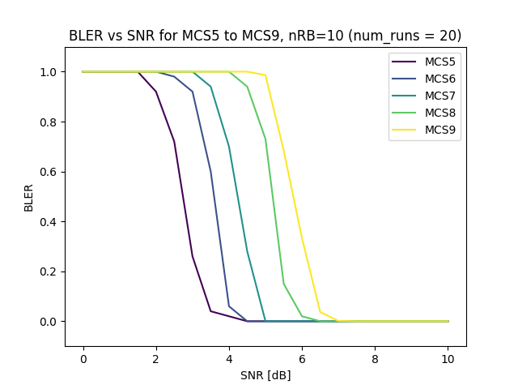

# Plotting tools

## `ul_bler_vs_snr_graph.py`

This generates UL BLER vs SNR plots using nr_ulsim. It uses cache so subsequent runs are faster.
Assumes your nr_ulsim is in `../../cmake_targets/ran_build/build`. Run with -h flag to see options

Example graph:

### Cache usage and modifting `nr_ulsim` command

Modify the script call to `nr_ulsim` if you want a different channel model or other flags in the `nr_ulsim` command.
Remember to clear the cache (remove `cache.pkl` from this folder) so that the results from a different run are not 
taken from the cache.
 
Same goes for any software modifications of `nr_ulsim` - the cache is not aware of the software version used to generate
the data - remember to clear your cache manually if you are comparing different `nr_ulsim` versions.

The script also allows to skip usage of the cache with `--rerun` option.
